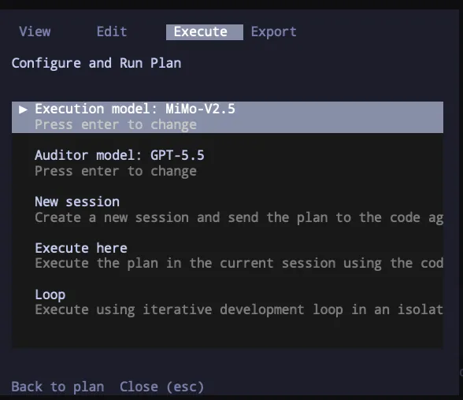
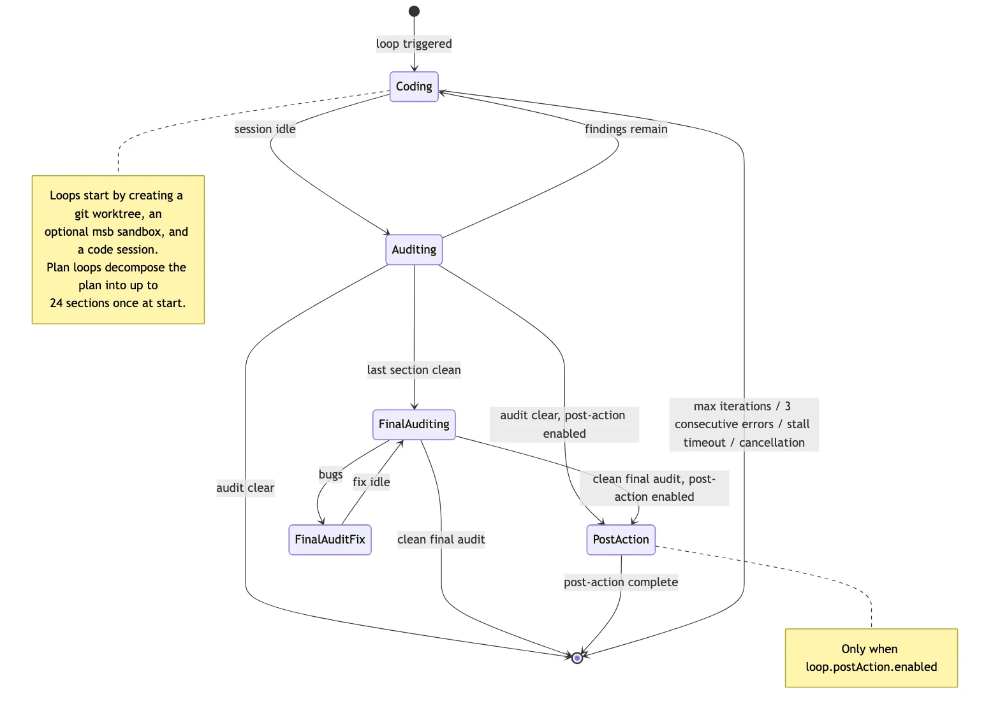

<p align="center">
  
</p>

<h1 align="center">OpenCode Forge</h1>

<p align="center">
  <strong>Loops, plans, sandboxing, and code review for <a href="https://opencode.ai">OpenCode</a> AI agents</strong>
</p>

<p align="center">
  <a href="https://www.npmjs.com/package/opencode-forge"></a>
  <a href="https://www.npmjs.com/package/opencode-forge"></a>
  <a href="https://github.com/chriswritescode-dev/opencode-forge/blob/main/LICENSE"></a>
</p>

## Quick Start

```bash
pnpm add opencode-forge
```

Add to your `opencode.json` to enable Forge's server-side hooks, tools, and agents:

```json
{
  "plugin": ["opencode-forge@latest"]
}
```

**For TUI features:** Also add to your `tui.json` to enable the sidebar and execution dialog:

```json
{
  "$schema": "https://opencode.ai/tui.json",
  "plugin": ["opencode-forge@latest"]
}
```

### Plugin-directory install

Instead of editing the `plugin` arrays by hand, the installer can wire the plugin into opencode's config directory:

```bash
bunx opencode-forge --link        # re-export shim for the current build
bunx opencode-forge --vendor      # self-contained copy (portable)
```

From a source checkout, use `pnpm run setup --link` or `pnpm run setup --vendor`. Both modes also write the `tui.json` `plugin` entry automatically — opencode does not auto-load the TUI plugin from the plugin directory, so the plugin directory alone cannot enable the sidebar and execution dialog. In a non-interactive shell the flags still require `-y`, `-f`, or `-k`.

| | `--link` | `--vendor` |
| --- | --- | --- |
| Picks up a rebuild | Yes — re-exports the live build | No — re-run after upgrade |
| Portable to another machine | No — absolute path to this checkout | Yes |
| Payload in config dir | Shim only | Full copy (~6.5 MB) |
| Needs re-run after upgrade | No | Yes |

Loops require OpenCode 1.17.8 or newer with `OPENCODE_EXPERIMENTAL_WORKSPACES=true` set in the environment that launches `opencode`:

```bash
export OPENCODE_EXPERIMENTAL_WORKSPACES=true
```

Without it, Forge cannot create loop worktrees, so plan loops, goal loops, TUI Loop launches, and grouped execution fail before their first session. See [Workspace Integration](docs/workspaces.md).

## What Forge Adds

Forge ships two plugin entrypoints plus standalone management surfaces:

- **Server plugin** — enabled through OpenCode plugin config in `opencode.json`. Provides the core hooks, tools, agents, plan storage, loop orchestration, review persistence, and sandbox support.
- **TUI plugin** — enabled separately in `tui.json`. Layers on the sidebar and execution dialog.
- **Installer CLI** — installs/upgrades bundled prompts and skills, and installs the plugin itself into opencode's plugin directory (`--link`/`--vendor`/`--unlink`).
- **Dashboard** — an observability interface launchable from the TUI command palette (`Open dashboard`) or via `pnpm dashboard` (source checkouts only).

For a quick tour of the loop itself, see [Loop Flow](#loop-flow) below.

## Features

- **Plans** — architect authors validated plans directly into SQL storage with `plan-write`/`plan-edit`
- **Execution** — approved-plan launch paths plus direct `/execute-goal` loops in dedicated worktree sessions; plan loops can also target a configured remote opencode server; grouped execution launches features from a PRD as parallel loops
- **Loops** — iterative coding/auditing with an isolated git worktree and optional msb sandbox
- **Review Findings** — persistent, loop-scoped review findings across loop sessions
- **TUI** — sidebar and execution dialog
- **Dashboard** — a repo shell for loops, groups, findings, and plans, with live loop state

## Documentation

- [Agents and Slash Commands](docs/agents-and-commands.md) — the bundled `code`, `architect`, and `auditor` agents, hidden loop agents, and every slash command.
- [Planning and Execution Workflow](docs/workflow.md) — how the architect authors plans, the three execution modes, variants, and grouped execution.
- [Tools Reference](docs/tools.md) — full arguments, section-scoping behavior, restart options, and sandbox shell details.
- [Loop System](docs/loop-system.md) — phases, section lifecycle, review findings, session rotation, stall detection, model configuration, and termination.
- [TUI Plugin](docs/tui.md) — sidebar, palette commands, the execution dialog, model selection, and setup.
- [Dashboard](docs/dashboard.md) — views, hash deep links, and the HTTP API.
- [Workspace Integration](docs/workspaces.md) — OpenCode workspace registration, requirements, and failure behavior.
- [Sandbox](docs/sandbox.md) — host requirements, image building and loading, network access, secrets, bind mounts, and resource defaults.
- [Configuration Reference](docs/configuration.md) — every option in `forge-config.jsonc`, plus the installer and bundled-asset sync.
- [Architecture](docs/architecture.md) — plugin architecture, module layout, hooks, storage, and data flow.
- [Modules](docs/modules.md) — the source tree and each module's public surface.
- [Common Issues](docs/troubleshooting.md) — worktree launch failures and workspace prerequisites.

## Screenshots

Execution flow dialog with mode and model selection:



## Loop Flow

The diagram below shows the overall flow of the Forge loop system — from loop trigger and provisioning through coding/auditing, section advancement, the final audit, and the optional post-action phase. See [Loop System](docs/loop-system.md) for the full lifecycle. Source: [`diagrams/loop-flow.mmd`](diagrams/loop-flow.mmd).



## Development

```bash
pnpm build      # Compile TypeScript to dist/
pnpm test       # Run tests
pnpm typecheck  # Type check without emitting
```

## License

MIT
