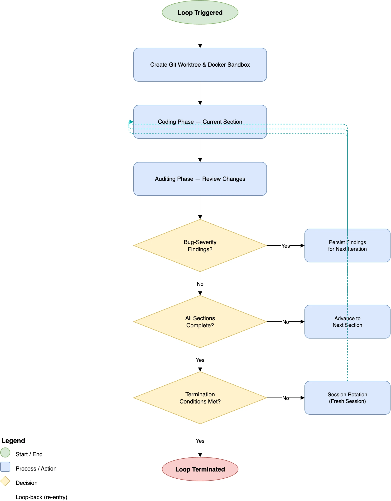

**opencode-forge**

***

<p align="center">
  
</p>

<h1 align="center">OpenCode Forge</h1>

<p align="center">
  <strong>Loops, plans, sandboxing, and code review for <a href="https://opencode.ai">OpenCode</a> AI agents</strong>
</p>

<p align="center">
  <a href="https://www.npmjs.com/package/opencode-forge"></a>
  <a href="https://www.npmjs.com/package/opencode-forge"></a>
  <a href="https://github.com/chriswritescode-dev/opencode-forge/blob/main/LICENSE"></a>
</p>

## Quick Start

```bash
pnpm add opencode-forge
```

Add to your `opencode.json` to enable Forge’s server-side hooks, tools, and agents:

```json
{
  "plugin": ["opencode-forge@latest"]
}
```

**For TUI features:** Also add to your `tui.json` to enable the sidebar and execution dialog:

```json
{
  "$schema": "https://opencode.ai/tui.json",
  "plugin": ["opencode-forge@latest"]
}
```

**Optional — workspace integration:** to let worktree loops appear as switchable OpenCode workspaces in the TUI, also export this in the environment that launches `opencode`:

```bash
export OPENCODE_EXPERIMENTAL_WORKSPACES=true
```

Requires OpenCode ≥ 1.15.0. Without it, loops still run normally — you just don't get workspace switching. See [Workspace Integration](#workspace-integration) for details.

## What Forge Adds

Forge ships two user-facing surfaces:

- **Server plugin** — enabled through OpenCode plugin config in `opencode.json`. The package declares the `server` oc-plugin surface and exports `./server` for the server entrypoint.
- **TUI plugin** — enabled separately in `tui.json`. The package declares the `tui` oc-plugin surface and exports `./tui` for the terminal UI entrypoint.

The server plugin provides the core hooks, tools, agents, plan storage, loop orchestration, review persistence, and sandbox support. The TUI plugin layers on a status sidebar and the execution dialog.

## Screenshots

Execution dialog with mode, model, and variant selection:


## Features

- **Plans** — architect produces marked plans that are auto-captured to SQL storage
- **Execution** — `New session`, `Execute here`, and `Loop` launch paths for approved plans
- **Loops** — iterative coding/auditing with isolated git worktree and optional Docker sandbox
- **Review Findings** — persistent, loop-scoped review findings across loop sessions
- **TUI** — sidebar status indicator and the execution dialog (opened from the command palette or `<leader>f`)
- **Sandbox** — Optional Docker worktree loop isolation with bind-mounted project files

## Agents

The plugin bundles three user-facing agents plus a hidden `auditor-loop` variant used by loop audit sessions:

| Agent | Mode | Description |
|-------|------|-------------|
| **code** | all | Primary coding agent. |
| **architect** | primary | Read-only planning agent. Researches the codebase, designs implementation plans, and caches them for user approval before execution. |
| **auditor** | subagent | Read-only code auditor for convention-aware reviews. Invoked via Task tool to review diffs, commits, branches, or PRs against stored conventions and decisions. |
| **auditor-loop** | primary, hidden | Internal audit agent used for loop-runner audit sessions. |

The auditor agent is a read-only subagent that cannot edit source files or execute plans. It is invoked by other agents via the Task tool to review code changes against stored project conventions and decisions.

**Tool restrictions:** The auditor cannot use the `loop` tool to prevent interference with active workflows.

The architect agent operates as a read-only planner with message-level reinforcement via the `experimental.chat.messages.transform` hook. Final plans are rendered once in the assistant response between `<!-- forge-plan:start -->` and `<!-- forge-plan:end -->` markers, then auto-captured into SQL before execution approval. After user approval via the question tool, execution is dispatched programmatically — no additional LLM calls are needed. The user can view and edit the cached plan from the sidebar or command palette before or during execution. 

## Tools

### Plan Tools

Session-scoped plan storage backed by SQL for managing implementation plans. Loop-associated plans are pruned with expired completed loops.

| Tool | Description |
|------|-------------|
| `plan-read` | Retrieve the plan. Supports pagination with offset/limit and pattern search. |
| `section-read` | Read a section plan and its status for the active loop session. Supports reading by index or defaulting to the lowest-index incomplete section. |

### Review Tools

Review finding storage for persisting audit results across session rotations.

| Tool | Description |
|------|-------------|
| `review-write` | Store a review finding with file, line, severity, and description. Findings are scoped to the current loop. |
| `review-read` | Retrieve review findings. Filter by file path or search by regex pattern. |
| `review-delete` | Delete a review finding by file and line. |

### Loop Tools

Iterative development loops with automatic auditing. Loops always run in an isolated git worktree; Docker sandbox is used automatically when available.

| Tool | Description |
|------|-------------|
| `loop` | Execute a plan using an iterative development loop in an isolated git worktree. Args: `title` required; `plan`, `loopName`, and `hostSessionId` optional. |
| `loop-cancel` | Cancel an active loop by worktree name |
| `loop-status` | List active/recent loops or get detailed status by worktree name, including cumulative token usage when available. Supports `restart=true` to restart any non-completed loop (`running`, `cancelled`, `errored`, `stalled`). Completed loops are history-only and cannot be restarted. |

`loop` reads the current session's captured plan when `plan` is omitted. `maxIterations`, execution model, auditor model, and sandbox behavior come from configuration or the TUI execution dialog, not direct `loop` tool arguments.

## Slash Commands

| Command | Description | Agent |
|---------|-------------|-------|
| `/review` | Run a code review on current changes | auditor (subtask) |
| `/loop` | Start an iterative development loop in a worktree | code |
| `/loop-status` | Check status of all active loops | code |
| `/loop-cancel` | Cancel the active loop | code |

## Configuration

On first run, the plugin automatically copies the bundled config to your config directory:
- If `XDG_CONFIG_HOME` is set: `$XDG_CONFIG_HOME/opencode/forge-config.jsonc`
- Otherwise: `~/.config/opencode/forge-config.jsonc`

**Note:** Configuration is stored at `~/.config/opencode/forge-config.jsonc` unless `XDG_CONFIG_HOME` is set.

The plugin supports JSONC format, allowing comments with `//` and `/* */`.

You can edit this file to customize settings. The file is created only if it doesn't already exist.

### Where Forge stores data

- Config: `~/.config/opencode/forge-config.jsonc` or `$XDG_CONFIG_HOME/opencode/forge-config.jsonc`
- Data dir: `~/.local/share/opencode/forge` or `$XDG_DATA_HOME/opencode/forge`
- Logs: `~/.local/share/opencode/forge/logs/forge.log`
- Log rotation: 10MB

Enable `logging.enabled` to write logs to disk. To use the default log path, omit `logging.file` or set it to `null` (an empty string is not treated as a default). Set `logging.debug` for more verbose output.

```jsonc
{
  // Data directory for plugin storage (SQL stores, logs)
  // When empty, resolves to ~/.local/share/opencode/forge (or XDG_DATA_HOME equivalent)
  "dataDir": "",

  // Logging configuration
  "logging": {
    "enabled": false,                // Enable file logging
    "debug": false,                 // Enable debug-level output
    "file": ""                      // Log file path (omit or set to null for default path)
  },

  // Session compaction settings
  "compaction": {
    "customPrompt": true,           // Use custom compaction prompt for continuity
    "maxContextTokens": 0           // Max tokens for context (0 = unlimited)
  },

  // Messages transform hook for read-only enforcement
  "messagesTransform": {
    "enabled": true,               // Enable transform hook
    "debug": false                 // Enable debug logging
  },

  // Model override for plan execution sessions (format: "provider/model")
  "executionModel": "",

  // Model override for the auditor agent (format: "provider/model")
  "auditorModel": "",

  // Iterative development loop settings
  "loop": {
    "enabled": true,               // Enable iterative loops
    "defaultMaxIterations": 15,    // Max iterations (0 = unlimited)
    "cleanupWorktree": false,      // Auto-remove worktree on cancel
    "stallTimeoutMs": 60000,       // Stall detection timeout (60s)
    "maxConsecutiveStalls": 5,     // Consecutive stalls before termination (0 = disabled)
    "worktreeLogging": {           // Worktree loop completion logging
      "enabled": false,            // Enable completion logging
      "directory": ""              // Log directory (defaults to platform data dir)
    }
  },

  // Sandbox configuration (optional; provisioned automatically when available)
  "sandbox": {
    "mode": "docker",
    "image": "oc-forge-sandbox:latest"
  },

  // TUI sidebar widget configuration
  "tui": {
    "sidebar": true,               // Show Forge sidebar in OpenCode TUI
    "showVersion": true,           // Show plugin version in sidebar title
    "keybinds": {                  // Keyboard shortcut overrides
      "executePlan": "<leader>f"   // Open the execution dialog. Avoid <leader>e — conflicts with opencode's editor_open
    }
  },

  // TTL in ms for completed/cancelled loops before cleanup. Default: 604800000 (7 days)
  "completedLoopTtlMs": 604800000,

  // Per-agent overrides (temperature range: 0.0 - 2.0)
  // Keys are agent display names (e.g., "code", "architect", "auditor")
  // "agents": {
  //   "architect": { "temperature": 0.0 },
  //   "auditor": { "temperature": 0.0 },
  //   "code": { "temperature": 0.7 }
  // }
}
```

### Options

#### Top-level
- `dataDir` - Data directory for plugin storage (SQL stores, logs). When empty, resolves to `~/.local/share/opencode/forge` (or `XDG_DATA_HOME` equivalent) (default: `""`)
- `completedLoopTtlMs` - TTL for completed/cancelled/errored/stalled loops before sweep (default: `604800000` / 7 days).
- `executionModel` - Model override for plan execution sessions, format: `provider/model` (e.g. `anthropic/claude-sonnet-4-20250514`). When set, plan execution (via the architect's approval flow or the TUI Execute panel) uses this model for the new Code session. When empty or omitted, OpenCode's default model is used (typically the `model` field from `opencode.json`). **Recommended:** Set this to a fast, cheap model (e.g. Haiku or MiniMax) and use a smart model (e.g. Opus) for the Architect session — planning needs reasoning, execution needs speed. This value is used as a fallback when no per-launch selection is made.
- `auditorModel` - Model override for the auditor agent (`provider/model`). When set, overrides the auditor agent's default model. When not set, uses platform default (default: `""`). This value is used as a fallback when no per-launch selection is made.
- `agents` - Per-agent temperature overrides keyed by display name (e.g., `"code"`, `"architect"`, `"auditor"`). Temperature range: `0.0` - `2.0` (default: `undefined`)

#### Logging
- `logging.enabled` - Enable file logging (default: `false`)
- `logging.debug` - Enable debug-level log output (default: `false`)
- `logging.file` - Log file path. Omitted or `null` falls back to `~/.local/share/opencode/forge/logs/forge.log` (default: `""`). Setting to an empty string `""` passes the empty string through and logging will fail silently. Logs remain in the data directory, only config has moved.

When enabled, logs are written to the specified file with timestamps. The log file has a 10MB size limit with automatic rotation.

#### Compaction
- `compaction.customPrompt` - Use a custom compaction prompt optimized for session continuity (default: `true`)
- `compaction.maxContextTokens` - Maximum tokens for context during compaction (default: `0` / unlimited)

#### Messages Transform
- `messagesTransform.enabled` - Enable the messages transform hook for Architect read-only enforcement (default: `true`)
- `messagesTransform.debug` - Enable debug logging for messages transform (default: `false`)

#### Loop
- `loop.enabled` - Enable iterative development loops (default: `true`)
- `loop.defaultMaxIterations` - Default max iterations for loops, 0 = unlimited (default: `15`)
- `loop.cleanupWorktree` - Auto-remove worktree on cancel (default: `false`)
- `loop.stallTimeoutMs` - Watchdog stall detection timeout in milliseconds (default: `60000`)
- `loop.maxConsecutiveStalls` - Number of consecutive stalls before the loop terminates with reason `stall_timeout`. Set to `0` to disable stall-based termination (default: `5`).
- `loop.worktreeLogging.enabled` - Enable worktree loop completion logging (default: `false`)
- `loop.worktreeLogging.directory` - Directory for completion logs, defaults to platform data dir (default: `""`)

#### Sandbox
- `sandbox.mode` - Sandbox mode: `"docker"` (optional; Docker sandbox is provisioned automatically when available)
- `sandbox.image` - Docker image for sandbox containers (default: `"oc-forge-sandbox:latest"`)
- `sandbox.resources` - Container resource limits mapped directly to `docker run` flags:
  - `memory` - Memory limit, e.g., `'8g'`. Maps to `--memory`.
  - `memorySwap` - Memory+swap limit, e.g., `'12g'`. Maps to `--memory-swap`.
  - `cpus` - Number of CPUs, e.g., `'4'`, `'2.5'`. Maps to `--cpus`.
  - `shmSize` - Shared memory size, e.g., `'1g'`. Maps to `--shm-size`.

#### TUI
- `tui.sidebar` - Show the forge sidebar widget in OpenCode TUI (default: `true`)
- `tui.showVersion` - Show plugin version number in the sidebar title (default: `true`)
- `tui.keybinds.executePlan` - Open the execution dialog for the current session's plan. Default: `<leader>f` ("Forge"). Avoid `<leader>e` — that's opencode's built-in `editor_open` and will shadow this binding. Set to `""` to leave the command unbound (it remains accessible from the command palette).

## TUI Plugin

The plugin includes a small sidebar status indicator and an execution dialog. Plans live in server-side SQL storage (`plansRepo`); there is no in-TUI editor, archive, or load-plan UI.

### Sidebar

The sidebar shows a single line: the plugin title (`Forge v<version>` when `tui.showVersion` is `true`, otherwise `Forge`). While the bus RPC is initialising it appends `· connecting`; if RPC stays unavailable it appends `· RPC unavailable`. The sidebar has no buttons or toggles.

Set `tui.sidebar: false` to skip registering the sidebar entirely.

### Execution Dialog

Open the dialog from the command palette as `Forge: Execute plan` or with the configured keybind (default `<leader>f`). The plan is read from the most recent architect message in the current session — Forge parses out the `<!-- forge-plan:start --> ... <!-- forge-plan:end -->` block. If no marked plan exists, the dialog does not open and a toast asks the architect to produce one first.

#### Execution Mode Selection

Choose from three execution modes:

1. **New session** — Creates a fresh Code session and sends the plan as the initial prompt
2. **Execute here** — Takes over the current session immediately with the plan
3. **Loop** — Launches an iterative coding/auditing loop in an isolated git worktree (Docker sandbox used automatically when available)

#### Model and Variant Selection

The dialog exposes pickers for the execution model, the auditor model, and (when the selected model supports them) provider-specific variants such as reasoning effort levels.

**Execution Model:**
- Full model picker grouped by Recent / connected providers / configured providers / all models
- Defaults to last-used selection, falling back to `config.executionModel` → OpenCode's global default

**Auditor Model:**
- Same picker
- Defaults to last-used selection, falling back to `config.auditorModel` → `config.executionModel` → OpenCode's global default

#### Persistence

Last-used model, auditor, variant, and mode are derived per-project from the server:

- `client.experimental.session.list(...)` supplies the execution model the user last picked in that project
- `client.experimental.workspace.list(...)` supplies the auditor model from Forge loop workspaces' `extra.forgeLoop` envelope
- `api.state` supplies OpenCode favorites and the user's global default model

There is no TUI-local SQLite store for recents or preferences — every input is fetched from the OpenCode server, so the dialog works the same when the TUI and server run on different hosts.

### Command Palette

The TUI plugin registers a single command:

- `Forge: Execute plan` (`<leader>f` by default) — opens the execution dialog for the current session's plan

The keybind is configurable via `tui.keybinds.executePlan`. Setting it to `""` leaves the command in the palette but unbound.

### Setup

When installed from the package, the TUI plugin loads automatically when added to your TUI config. The plugin is auto-detected via the `./tui` export in `package.json`.

Add to your `~/.config/opencode/tui.json` or project-level `tui.json`:

```json
{
  "$schema": "https://opencode.ai/tui.json",
  "plugin": [
    "opencode-forge"
  ]
}
```

### Model Picker

Models are displayed in priority order:

1. **Recent** — derived from recent sessions and workspaces for the current project, plus OpenCode favorites and global default. Capped at 10 entries.
2. **Connected providers** — Models from currently connected providers
3. **Configured providers** — Models from providers defined in your OpenCode config
4. **All models** — Remaining models sorted alphabetically by provider and model name

Each entry shows the model name, provider, and capability hints (reasoning, tool calls). A **"Use default"** option at the top defers to OpenCode's global default.

### Configuration

TUI options are configured in `~/.config/opencode/forge-config.jsonc` under the `tui` key:

```jsonc
{
  "tui": {
    "sidebar": true,
    "showVersion": true
  }
}
```

Set `sidebar` to `false` to completely disable the widget.

For local development, reference the built TUI file directly:

```json
{
  "$schema": "https://opencode.ai/tui.json",
  "plugin": [
    "/path/to/opencode-forge/dist/tui.js"
  ]
}
```

## Planning and Execution Workflow

Plan with a smart model, execute with a fast model. The architect agent researches the codebase and designs an implementation plan; the code agent implements it.

### How Plans Work

The architect is read-only and must output exactly one final plan between `<!-- forge-plan:start -->` and `<!-- forge-plan:end -->` markers. Forge auto-captures that marked plan into SQL storage for the current session.

The user can view the cached plan at any time from the **sidebar** (Load plan button) or the **command palette** (`Forge: View plan`). The plan viewer renders full GitHub-flavored markdown and supports inline editing — the user can modify the plan directly before approving.

### Execution

After the architect presents a summary, the user chooses an execution mode from the execution dialog:

- **New session** — Creates a new Code session and sends the plan as the initial prompt.
- **Execute here** — The code agent takes over the current session immediately with the plan.
- **Loop** — Creates an isolated git worktree and launches an iterative coding/auditing loop. Docker sandbox is provisioned automatically when available; otherwise the loop runs in worktree-only mode.

| Mode | When to choose it |
|------|-------------------|
| `New session` | Default for normal implementation |
| `Execute here` | When preserving current context matters |
| `Loop` | Safer autonomous iteration |

The dialog also lets you pick the execution model and auditor model at launch time. Those selections are remembered per project and pre-filled on later launches. Optional **variant selectors** accompany each model selector, letting you choose provider-specific reasoning or thinking-effort levels (e.g., `low`, `high`, `max`) when the model exposes them. Variant selections are also persisted per project.

Execution is immediate — there are no additional LLM calls between approval and execution. The system intercepts the user's approval answer, reads the cached plan, and dispatches it programmatically to the code agent. The architect never processes the approval response.

### Model Selection Priority

Model selection follows this priority order:

**For execution model:**
1. Dialog selection (last-used, persisted per-project)
2. `config.executionModel`
3. Platform default

**For auditor model:**
1. Dialog selection (last-used, persisted per-project)
2. `config.auditorModel`
3. `config.executionModel`
4. Platform default

### Troubleshooting

- **No plan found** — Ensure the architect output included the forge plan markers, or open the Plan Viewer for the current session.
- **TUI shows no plan** — The plan is session-scoped; use `Forge: View plan` in the session where the architect produced it.
- **Need logs** — Set `logging.enabled` to `true`, and optionally `logging.debug` for verbose output.

## Loop

The loop is an iterative development system that alternates between coding and auditing phases:

1. **Coding phase** — A Code session works on the task
2. **Auditing phase** — The Auditor agent reviews changes against project conventions and stored review findings
3. **Session rotation** — A fresh session is created for the next iteration
4. **Repeat** — Audit findings feed back into the next coding iteration

### Session Rotation

Each iteration runs in a **fresh session** to keep context small and prioritize speed. After each phase completes, the current session is destroyed and a new one is created. The original task prompt and any audit findings are re-injected into the new session as a continuation prompt, so no context is lost while keeping the window clean.

### Review Finding Persistence

Audit findings survive session rotation via the **review store**. The auditor stores each bug and warning using `review-write` with file, line, severity, and description. At the start of each audit:

- Existing findings are retrieved via `review-read`
- Resolved findings are deleted via `review-delete`
- Unresolved findings are carried forward into the review

### Usage Tracking

Loop sessions rotate between code and auditor work, so Forge persists per-session usage rows in `loop_session_usage` and merges them for `loop-status`. Detailed status includes cumulative cost, input/output/reasoning/cache token totals, per-model breakdowns, and live active-session output when available.

### Worktree Isolation

Loops always run in an isolated git worktree. Sandbox is optional: when Docker is available and `sandbox.mode = 'docker'` is configured, a sandbox container is provisioned automatically; otherwise the loop runs in worktree-only mode. Changes are auto-committed and the worktree is removed on completion (branch preserved for later merge).

### Auditor Integration

After each coding iteration, the auditor agent reviews changes against project conventions and stored review findings. Findings are persisted via `review-write` scoped to the current loop. Outstanding `severity: 'bug'` findings block completion — the loop terminates only when the auditor has run at least once and zero bug-severity findings remain.

### Stall Detection

A watchdog monitors loop activity. If no progress is detected within `stallTimeoutMs` (default: 60s), the current phase is re-triggered. After `maxConsecutiveStalls` consecutive stalls (default: 5), the loop terminates with reason `stall_timeout`. Use `loop-status` with `restart` to resume from the persisted section/iteration.

### Model Configuration

Loops use the following priority order for model selection:

1. **Dialog selection** — Model chosen in the execution dialog (persisted per-project)
2. `executionModel` — Global execution model fallback
3. Platform default — OpenCode's default model

The auditor model follows a similar chain: dialog selection → `auditorModel` → `executionModel` → platform default.

When launching from the TUI dialog, your selection is remembered and pre-filled on subsequent launches. The dialog also allows selecting a separate model for the auditor phase.

On model errors during execution, automatic fallback to the default model kicks in.

### Safety

- `git push` is denied inside active loop sessions
- Tools like `question` and `loop` are blocked to prevent recursive loops and keep execution autonomous

### Management

- **Slash commands**: `/loop` to start, `/loop-cancel` to cancel
- **Tools**: `loop` to start with parameters, `loop-status` for checking progress (with restart capability), `loop-cancel` to cancel

### Loop termination

The loop terminates when any of these conditions is met:

- **Max iterations** — The global `maxIterations` cap is exceeded (0 = unlimited).
- **Stall timeout** — After `maxConsecutiveStalls` consecutive stalls (default: 5). Use `loop-status` with `restart` to resume from the persisted section and iteration.
- **Final audit completion** — When no bug-severity review findings remain after the final audit phase.
- **Consecutive errors** — 3 consecutive errors in either phase.

Loops always run in an isolated git worktree. Sandbox is optional: when Docker is available and `sandbox.mode = 'docker'` is configured, a sandbox container is provisioned automatically; otherwise the loop runs in worktree-only mode.

## Workspace Integration

Worktree loops can optionally register as **OpenCode workspaces**, letting you switch between them (and your main project) from the same TUI session without restarting or re-opening anything.

### Requirements

Workspace integration requires the **experimental workspace runtime** to be enabled in OpenCode itself. The plugin API surface (`experimental_workspace.register`) is always present, but the underlying sync, session-scoping, and TUI dialogs are gated behind an environment variable. Without it, Forge's adapter registers fine but `workspace.create` silently no-ops and the TUI never shows worktree workspaces.

Set one of these in the environment that launches `opencode`:

```bash
export OPENCODE_EXPERIMENTAL_WORKSPACES=true
# or, to enable every experimental opencode feature at once:
export OPENCODE_EXPERIMENTAL=true
```

Accepted values are `true` or `1` (case-insensitive). Requires **OpenCode ≥ 1.15.0**.

> The `OPENCODE_EXPERIMENTAL_WORKSPACES` flag is not currently documented on opencode.ai. The authoritative source is `packages/core/src/flag/flag.ts` and `packages/opencode/src/effect/runtime-flags.ts` in the OpenCode repo.

No forge config option enables or disables this — the toggle is purely on the OpenCode side.

### When workspace integration is active

- **Env var set, OpenCode ≥ 1.15.0** → worktree loops become workspace-backed. The worktree directory appears as a switchable workspace in the TUI, and its sessions are bound to that workspace.
- **Env var unset or older OpenCode** → Forge's adapter still registers (the API surface is always present), but `workspace.create` no-ops and the loop runs as a plain worktree loop with no workspace switching. Everything else (iteration, auditing, sandbox, status, cancel, restart) is unaffected.

### What it does

When a worktree loop starts with `OPENCODE_EXPERIMENTAL_WORKSPACES=true`, forge:

1. Calls `experimental.workspace.create` with `type: "forge"`, `branch: null`, and `extra: { loopName, projectDirectory, workspaceCreatedAt }` to register the workspace through the `forge` adapter
2. The adapter's `create` hook creates the git worktree (reusing an orphaned branch when possible) and, when configured, provisions the Docker sandbox container
3. Creates a new Code session pointed at the worktree directory
4. Calls `experimental.workspace.warp` to bind the session to that workspace
5. Persists the workspace ID on the loop record (`loops.workspace_id`) so the TUI can route clicks on a loop into the correct workspace

The adapter's `remove` hook commits in-flight changes (when teardown context allows), stops the sandbox container if any, and removes the worktree directory unless the loop is restartable. Branches are preserved for later restart or merge.

### Graceful degradation

If workspace creation or session binding fails at runtime — env var unset, OpenCode version too old, network error, API mismatch — the loop **does not abort**. Forge logs the failure, clears the workspace ID, and the loop continues as a regular (non-workspace) worktree loop. You lose workspace-based switching for that loop, but iteration, auditing, sandbox, and restart all run to completion.

### From the TUI

- Loops are launched via the Execute tab in the Plan Viewer dialog (select Loop mode)
- On hosts with workspace support, active loops appear as switchable workspaces alongside your main project

## Docker Sandbox

Run loop iterations inside an isolated Docker container. Three tools (`bash`, `glob`, `grep`) execute inside the container via `docker exec`, while `read`/`write`/`edit` operate on the host filesystem. Your project directory is bind-mounted at `/workspace` for instant file sharing.

### Prerequisites

- Docker running on your machine

### Setup

**1. Build the sandbox image:**

```bash
docker build -t oc-forge-sandbox:latest container/
```

The image includes Node.js 24, pnpm, Bun, Python 3 + uv, ripgrep, git, and jq.

**2. Configure the sandbox** (`~/.config/opencode/forge-config.jsonc`):

```jsonc
{
  "sandbox": {
    "mode": "docker",
    "image": "oc-forge-sandbox:latest"
  }
}
```

**3. Restart OpenCode.**

### Usage

Start a sandbox loop via the architect plan approval flow (select "Loop") or directly with the `loop` tool:

```
loop
```

Sandbox is optional. When Docker is available and configured, a sandbox container is provisioned automatically; otherwise the loop runs in worktree-only mode. The loop:
1. Creates a git worktree
2. Starts a Docker container with the worktree directory bind-mounted at `/workspace`
3. Redirects `bash`, `glob`, and `grep` tool calls into the container
4. Cleans up the container on loop completion or cancellation

### How It Works

- **Bind mount** -- the project directory is mounted directly into the container at `/workspace`. No sync daemon, no file copying. Changes are visible instantly on both sides.
- **Tool redirection** -- `bash`, `glob`, and `grep` route through `docker exec` when a session belongs to a sandbox loop. The `read`/`write`/`edit` tools operate on the host filesystem directly (compatible with host LSP).
- **Git blocking** -- git commands are explicitly blocked inside the container. All git operations (commit, push, branch management) are handled by the loop system on the host.
- **Host LSP** -- since files are shared via the bind mount, OpenCode's LSP servers on the host read the same files and provide diagnostics after writes and edits.
- **Container lifecycle** -- one container per loop, automatically started and stopped. Container name format: `forge-<worktreeName>`.

### Configuration

| Option | Default | Description |
|--------|---------|-------------|
| `sandbox.mode` | `"docker"` | Sandbox mode (optional; Docker used when available) |
| `sandbox.image` | `"oc-forge-sandbox:latest"` | Docker image to use for sandbox containers |

### Customizing the Image

The `container/Dockerfile` is included in the project. To add project-specific tools (e.g., Go, Rust, additional language servers), edit the Dockerfile and rebuild:

```bash
docker build -t oc-forge-sandbox:latest container/
```

## Development

```bash
pnpm build      # Compile TypeScript to dist/
pnpm test       # Run tests
pnpm typecheck  # Type check without emitting
```

## Loop Flow

The diagram below shows the overall flow of the Forge loop system — from plan capture through iterative coding/auditing phases with section advancement and session rotation.



## License

MIT
