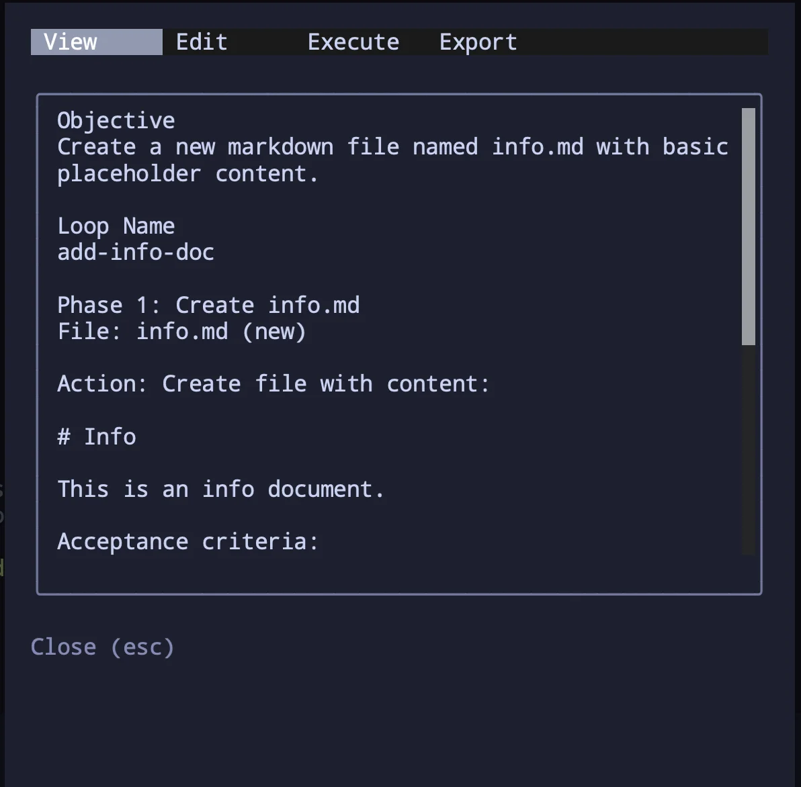
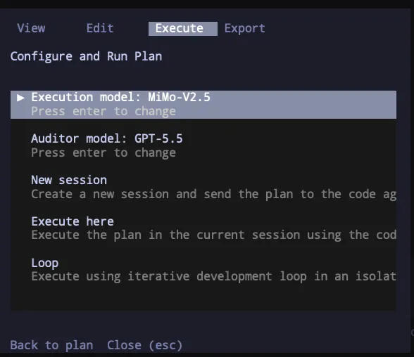
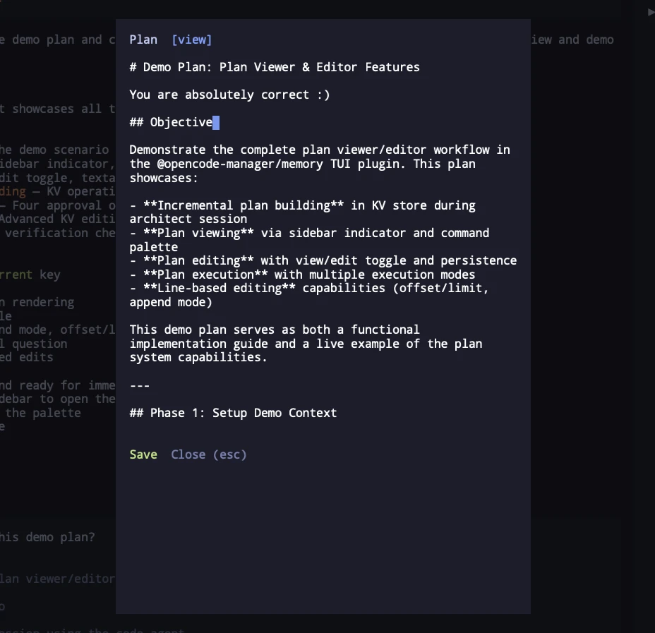
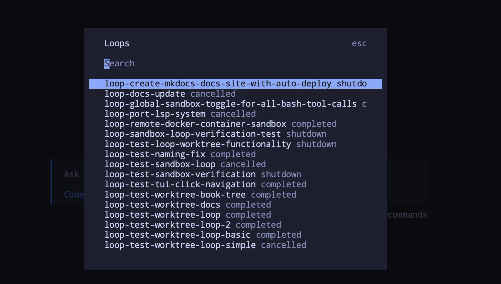

**opencode-forge**

***

<p align="center">
  
</p>

<h1 align="center">OpenCode Forge</h1>

<p align="center">
  <strong>Loops, plans, sandboxing, and code intelligence for <a href="https://opencode.ai">OpenCode</a> AI agents</strong>
</p>

<p align="center">
  <a href="https://www.npmjs.com/package/opencode-forge"></a>
  <a href="https://www.npmjs.com/package/opencode-forge"></a>
  <a href="https://github.com/chriswritescode-dev/opencode-forge/blob/main/LICENSE"></a>
</p>

## Breaking change (v0.3.0)

Forge no longer runs an HTTP control plane. The TUI plugin now communicates with the server plugin over the opencode bus using `tui.command.execute` events. This removes:

- The HTTP server (port 5552) and all HTTP API endpoints
- `OPENCODE_SERVER_PASSWORD` requirement for forge operations
- Coordinator handover and slot management
- `tui.remoteServer.url` configuration
- `api` configuration section

On upgrade, the `api_registry`, `api_coordinators`, and `api_project_instances` tables are dropped. No user action is required other than updating your plugin configuration to remove the deprecated `api` and `tui.remoteServer` properties.

## Breaking change (v0.2.0)

Forge has replaced its generic key-value store with dedicated typed tables for loops, plans, review findings, and TUI preferences. On upgrade:

- Existing loops, plans, review findings, and TUI preferences stored in the old `project_kv` table are dropped.
- Active loops from the previous version will not be resumed (they are already effectively dead due to the schema change and should be considered cancelled).
- No user action required other than restarting opencode.
- The config key `defaultKvTtlMs` has been renamed to `completedLoopTtlMs`. The old name is no longer supported.

## Quick Start

```bash
pnpm add opencode-forge
```

Add to your `opencode.json` to enable Forge’s server-side hooks, tools, and agents:

```json
{
  "plugin": ["opencode-forge@latest"]
}
```

**For TUI features:** Also add to your `tui.json` to enable the sidebar, plan viewer, execution dialog, and loop UI:

```json
{
  "$schema": "https://opencode.ai/tui.json",
  "plugin": ["opencode-forge@latest"]
}
```

## What Forge Adds

Forge ships three user-facing surfaces:

- **Server plugin** — enabled through OpenCode plugin config in `opencode.json`. The package declares the `server` oc-plugin surface and exports `./server` for the server entrypoint.
- **TUI plugin** — enabled separately in `tui.json`. The package declares the `tui` oc-plugin surface and exports `./tui` for the terminal UI entrypoint.
- **CLI** — the `oc-forge` binary manages loops from the terminal.

The server plugin provides the core hooks, tools, agents, plan storage, loop orchestration, review persistence, and sandbox support. The TUI plugin layers on sidebar, plan, execution, and loop dialogs. The CLI is source-backed by the package binary and the CLI entrypoint.

## Screenshots

Plan viewer showing the plan in rendered markdown format:



Execution flow dialog with mode and model selection:



Plan editor with raw text editing:



Loop search dialog:



## Features

- **Plans** — architect produces marked plans that are auto-captured to SQL storage
- **Execution** — `New session`, `Execute here`, `Loop`, and `Loop (worktree)` launch paths for approved plans
- **Loops** — iterative coding/auditing with optional worktree isolation and sandbox support
- **Review Findings** — persistent, branch-aware review findings across loop sessions
- **TUI** — sidebar, plan viewer/editor, execution dialog, and loop details
- **CLI** — loop management through `oc-forge`
- **Sandbox** — Docker worktree loop isolation with bind-mounted project files

## Agents

The plugin bundles three agents that integrate with ast-grep for code intelligence:

| Agent | Mode | Description |
|-------|------|-------------|
| **code** | primary | Primary coding agent with ast-grep CLI-assisted discovery. Uses ast-grep CLI for structural code intelligence before diving into unfamiliar code. |
| **architect** | primary | Read-only planning agent with ast-grep CLI-assisted discovery. Researches the codebase, designs implementation plans, and caches them for user approval before execution. |
| **auditor** | subagent | Read-only code auditor with ast-grep CLI-assisted analysis for convention-aware reviews. Invoked via Task tool to review diffs, commits, branches, or PRs against stored conventions and decisions. |

The auditor agent is a read-only subagent (`temperature: 0.0`) that cannot write, edit, or delete entries or execute plans. It is invoked by other agents via the Task tool to review code changes against stored project conventions and decisions.

**Tool restrictions:** The auditor cannot use `plan-execute` or `loop` tools to prevent interference with active workflows.

The architect agent operates in read-only mode (`temperature: 0.0`, all edits denied) with message-level enforcement via the `experimental.chat.messages.transform` hook. Final plans are rendered once in the assistant response between `<!-- forge-plan:start -->` and `<!-- forge-plan:end -->` markers, then auto-captured into SQL before execution approval. After user approval via the question tool, execution is dispatched programmatically — no additional LLM calls are needed. The user can view and edit the cached plan from the sidebar or command palette before or during execution. 

## Tools

### Plan Tools

Session-scoped plan storage backed by SQL for managing implementation plans. Loop-associated plans are pruned with expired completed loops.

| Tool | Description |
|------|-------------|
| `plan-read` | Retrieve the plan. Supports pagination with offset/limit and pattern search. |
| `plan-execute` | Create a new Code session and send an approved plan as the first prompt |

### Review Tools

Review finding storage for persisting audit results across session rotations.

| Tool | Description |
|------|-------------|
| `review-write` | Store a review finding with file, line, severity, and description. Auto-injects branch field. |
| `review-read` | Retrieve review findings. Filter by file path or search by regex pattern. |
| `review-delete` | Delete a review finding by file and line. |

### Loop Tools

Iterative development loops with automatic auditing. Defaults to current directory execution; set `worktree: true` for isolated git worktree.

| Tool | Description |
|------|-------------|
| `loop` | Execute a plan using an iterative development loop. Default runs in current directory. Set `worktree` to true for isolated git worktree. |
| `loop-cancel` | Cancel an active loop by worktree name |
| `loop-status` | List all active loops or get detailed status by worktree name. Supports `restart` to resume inactive loops. |

## Slash Commands

| Command | Description | Agent |
|---------|-------------|-------|
| `/review` | Run a code review on current changes | auditor (subtask) |
| `/loop` | Start an iterative development loop in a worktree | code |
| `/loop-status` | Check status of all active loops | code |
| `/loop-cancel` | Cancel the active loop | code |

## CLI

Manage loops using the `oc-forge` CLI. The CLI auto-detects the project ID from git.

```bash
oc-forge <command> [options]
```

**Global options** (apply to all commands):

| Flag | Description |
|------|-------------|
| `--project, -p <name>` | Project name or SHA (auto-detected from git) |
| `--dir, -d <path>` | Git repo path for project detection |
| `--db-path <path>` | Path to forge database |
| `--help, -h` | Show help |

### Commands

#### upgrade

Check for plugin updates and install the latest version.

```bash
oc-forge upgrade
```

#### status

Show loop status for the current project.

```bash
oc-forge loop status
oc-forge loop status --project my-project
```

| Flag | Description |
|------|-------------|
| `--project, -p <name>` | Project name or SHA (auto-detected from git) |

#### cancel

Cancel a loop by worktree name.

```bash
oc-forge loop cancel my-worktree-name
oc-forge loop cancel --project my-project my-worktree-name
```

| Flag | Description |
|------|-------------|
| `--project, -p <name>` | Project name or SHA (auto-detected from git) |

#### restart

Restart a loop by worktree name.

```bash
oc-forge loop restart my-worktree-name
oc-forge loop restart --project my-project my-worktree-name
```

| Flag | Description |
|------|-------------|
| `--project, -p <name>` | Project name or SHA (auto-detected from git) |
| `--force` | Force restart an active loop without confirmation |
| `--server <url>` | OpenCode server URL (default: http://localhost:5551) |

## Configuration

On first run, the plugin automatically copies the bundled config to your config directory:
- If `XDG_CONFIG_HOME` is set: `$XDG_CONFIG_HOME/opencode/forge-config.jsonc`
- Otherwise: `~/.config/opencode/forge-config.jsonc`

**Note:** Configuration is stored at `~/.config/opencode/forge-config.jsonc` unless `XDG_CONFIG_HOME` is set.

The plugin supports JSONC format, allowing comments with `//` and `/* */`.

You can edit this file to customize settings. The file is created only if it doesn't already exist.

### Where Forge stores data

- Config: `~/.config/opencode/forge-config.jsonc` or `$XDG_CONFIG_HOME/opencode/forge-config.jsonc`
- Data dir: `~/.local/share/opencode/forge` or `$XDG_DATA_HOME/opencode/forge`
- Logs: `~/.local/share/opencode/forge/logs/forge.log`
- Log rotation: 10MB

Enable `logging.enabled` to write logs to disk. To use the default log path, omit `logging.file` or set it to `null` (an empty string is not treated as a default). Set `logging.debug` for more verbose output.

```jsonc
{
  // Data directory for plugin storage (SQL stores, logs)
  // When empty, resolves to ~/.local/share/opencode/forge (or XDG_DATA_HOME equivalent)
  "dataDir": "",

  // Logging configuration
  "logging": {
    "enabled": false,                // Enable file logging
    "debug": false,                 // Enable debug-level output
    "file": ""                      // Log file path (omit or set to null for default path)
  },

  // Session compaction settings
  "compaction": {
    "customPrompt": true,           // Use custom compaction prompt for continuity
    "maxContextTokens": 0           // Max tokens for context (0 = unlimited)
  },

  // Messages transform hook for read-only enforcement
  "messagesTransform": {
    "enabled": true,               // Enable transform hook
    "debug": false                 // Enable debug logging
  },

  // Model override for plan execution sessions (format: "provider/model")
  "executionModel": "",

  // Model override for the auditor agent (format: "provider/model")
  "auditorModel": "",

  // Iterative development loop settings
  "loop": {
    "enabled": true,               // Enable iterative loops
    "defaultMaxIterations": 15,    // Max iterations (0 = unlimited)
    "cleanupWorktree": false,      // Auto-remove worktree on cancel
    "model": "",                   // Reserved; not actively read. Use executionModel instead.
    "stallTimeoutMs": 60000,       // Stall detection timeout (60s)
    "worktreeLogging": {           // Worktree loop completion logging
      "enabled": false,            // Enable completion logging
      "directory": ""              // Log directory (defaults to platform data dir)
    }
  },

  // Docker sandbox configuration for isolated loop execution
  "sandbox": {
    "mode": "off",                 // Sandbox mode: "off" or "docker"
    "image": "oc-forge-sandbox:latest"  // Docker image for sandbox containers
  },

  // TUI sidebar widget configuration
  "tui": {
    "sidebar": true,               // Show Forge sidebar in OpenCode TUI
    "showLoops": true,             // Display loop status in sidebar
    "showVersion": true,           // Show plugin version in sidebar title
    "keybinds": {                  // Keyboard shortcut overrides
      "viewPlan": "<leader>v",     // View plan dialog
      "executePlan": "<leader>e",  // Execute plan dialog
      "showLoops": "<leader>w"     // Show loops dialog
    }
  },

  // TTL in ms for completed/cancelled loops before cleanup. Default: 604800000 (7 days)
  "completedLoopTtlMs": 604800000,

  // Per-agent overrides (temperature range: 0.0 - 2.0)
  // Keys are agent display names (e.g., "code", "architect", "auditor")
  // "agents": {
  //   "architect": { "temperature": 0.0 },
  //   "auditor": { "temperature": 0.0 },
  //   "code": { "temperature": 0.7 }
  // }
}
```

### Options

#### Top-level
- `dataDir` - Data directory for plugin storage. When empty, resolves to `~/.local/share/opencode/forge` (or `XDG_DATA_HOME` equivalent) (default: `""`)
- `completedLoopTtlMs` - TTL for completed/cancelled/errored/stalled loops before sweep (default: `604800000` / 7 days).
- `executionModel` - Model override for plan execution sessions, format: `provider/model` (e.g. `anthropic/claude-sonnet-4-20250514`). When set, `plan-execute` uses this model for the new Code session. When empty or omitted, OpenCode's default model is used (typically the `model` field from `opencode.json`). **Recommended:** Set this to a fast, cheap model (e.g. Haiku or MiniMax) and use a smart model (e.g. Opus) for the Architect session — planning needs reasoning, execution needs speed. This value is used as a fallback when no per-launch selection is made.
- `auditorModel` - Model override for the auditor agent (`provider/model`). When set, overrides the auditor agent's default model. When not set, uses platform default (default: `""`). This value is used as a fallback when no per-launch selection is made.
- `agents` - Per-agent temperature overrides keyed by display name (e.g., `"code"`, `"architect"`, `"auditor"`). Temperature range: `0.0` - `2.0` (default: `undefined`)

#### Logging
- `logging.enabled` - Enable file logging (default: `false`)
- `logging.debug` - Enable debug-level log output (default: `false`)
- `logging.file` - Log file path. Omitted or `null` falls back to `~/.local/share/opencode/forge/logs/forge.log` (default: `""`). Setting to an empty string `""` passes the empty string through and logging will fail silently. Logs remain in the data directory, only config has moved.

When enabled, logs are written to the specified file with timestamps. The log file has a 10MB size limit with automatic rotation.

#### Compaction
- `compaction.customPrompt` - Use a custom compaction prompt optimized for session continuity (default: `true`)
- `compaction.maxContextTokens` - Maximum tokens for context during compaction (default: `0` / unlimited)

#### Messages Transform
- `messagesTransform.enabled` - Enable the messages transform hook that handles Architect read-only enforcement (default: `true`)
- `messagesTransform.debug` - Enable debug logging for messages transform (default: `false`)

#### Loop
- `loop.enabled` - Enable iterative development loops (default: `true`)
- `loop.defaultMaxIterations` - Default max iterations for loops, 0 = unlimited (default: `15`)
- `loop.cleanupWorktree` - Auto-remove worktree on cancel (default: `false`)
- `loop.model` — Reserved field in the type; not currently read by the loop system. Use `executionModel` for model overrides.
- `loop.stallTimeoutMs` - Watchdog stall detection timeout in milliseconds (default: `60000`)
- `loop.worktreeLogging.enabled` - Enable worktree loop completion logging (default: `false`)
- `loop.worktreeLogging.directory` - Directory for completion logs, defaults to platform data dir (default: `""`)

**Migration note:** As of v0.2.0, auditing runs unconditionally after each coding iteration. The `loop.defaultAudit` option was removed and audit is now always enabled. If you previously had `"defaultAudit": false` in your config, audits will now run on every iteration regardless of that setting.

#### Sandbox
- `sandbox.mode` - Sandbox mode: `"off"` or `"docker"` (default: `"off"`)
- `sandbox.image` - Docker image for sandbox containers (default: `"oc-forge-sandbox:latest"`)

#### TUI
- `tui.sidebar` - Show the forge sidebar widget in OpenCode TUI (default: `true`)
- `tui.showLoops` - Display active loop status in the sidebar (default: `true`)
- `tui.showVersion` - Show plugin version number in the sidebar title (default: `true`)
- `tui.keybinds` - Keyboard shortcut overrides for Forge commands (default: `<leader>v`, `<leader>e`, `<leader>w`)

## TUI Plugin

The plugin includes a TUI sidebar widget and dialog system for monitoring and managing loops directly in the OpenCode terminal interface.

### Sidebar

The sidebar shows all loops for the current project:

- Loop name (truncated to 25 chars with middle ellipsis) with a colored status dot
- Status text: current phase for active loops, termination reason for completed/cancelled
- Clicking a **worktree loop** opens the Loop Details dialog
- Clicking a **non-worktree loop** navigates directly to its session
- **Plan indicator** — When a plan exists for the current session, a 📋 Plan link appears. Click it to open the Plan Viewer dialog.

### Plan Viewer

When an architect session produces a plan, it is cached in the current session plan store. The plan is accessible from the sidebar (📋 Plan link) or the command palette (`Forge: View plan`). Missing plans show an informational toast.

The plan viewer dialog renders the full plan as GitHub-flavored markdown with syntax highlighting:

- **View tab** — Rendered markdown view with full formatting
- **Edit tab** — Raw text editor for direct plan modification. Click **Save** to write changes back to the current session plan store
- **Execute tab** — Opens the execution dialog with mode and model selection
- **Export** — Exports the plan to a markdown file in the project directory

### Execution Dialog

The Execute tab provides a comprehensive dialog for launching plans with full control over execution parameters:

#### Execution Mode Selection

Choose from four execution modes:

1. **New session** — Creates a fresh Code session and sends the plan as the initial prompt
2. **Execute here** — Takes over the current session immediately with the plan
3. **Loop (worktree)** — Launches an iterative coding/auditing loop in an isolated git worktree
4. **Loop** — Launches an iterative coding/auditing loop in the current directory

#### Model Selection

Two model selectors are available:

**Execution Model:**
- Opens a full model selection dialog with all available providers
- Shows recently used models (last 10, 90-day TTL) for quick access
- Displays model capabilities (reasoning, tools support) in descriptions
- Defaults to last-used selection, falling back to `config.executionModel`

**Auditor Model:**
- Same model selection interface
- Defaults to last-used selection, falling back to `config.auditorModel` → `config.executionModel`

#### Persistence

Your selections are automatically saved in `tui_preferences` after launch:
- Last-used mode and models are persisted per-project (30-day TTL)
- Subsequent plan executions pre-fill with your previous choices
- Recent models are tracked across all dialog interactions

### Loop Details Dialog

The Loop Details dialog shows a detailed view of a single loop:

- Name and status badge (active / completed / error / cancelled / stalled)
- Session stats: session ID, iteration count, token usage (input/output/cache), cost
- Latest output from the last assistant message (scrollable, up to 500 chars)
- **Back** — return to the loop list (when opened from the command palette)
- **Cancel loop** — abort the active loop session (visible only when loop is active)
- **Close (esc)** — dismiss the dialog

### Command Palette

The command palette registers three Forge commands when the relevant session or loop data exists:

- `Forge: Show loops` — opens the worktree loop list, then drills into Loop Details with a Back button to return
- `Forge: View plan` — opens the cached plan for the current session
- `Forge: Execute plan` — opens the execution flow for the cached plan

### Setup

When installed from the package, the TUI plugin loads automatically when added to your TUI config. The plugin is auto-detected via the `./tui` export in `package.json`.

Add to your `~/.config/opencode/tui.json` or project-level `tui.json`:

```json
{
  "$schema": "https://opencode.ai/tui.json",
  "plugin": [
    "opencode-forge"
  ]
}
```

### Model Selection Dialog

The TUI provides a comprehensive model selection dialog when executing plans. The dialog features:

#### Model Organization

Models are displayed in priority order:

1. **Recent** — Last 10 models used across all dialogs (90-day TTL)
2. **Connected providers** — Models from currently connected providers
3. **Configured providers** — Models from providers defined in your OpenCode config
4. **All models** — Remaining models sorted alphabetically by provider and model name

Each model shows:
- Model name and provider
- Capabilities (reasoning, tools support)
- Full identifier (e.g., `anthropic/claude-sonnet-4-20250514`)

#### Quick Access

- **"Use default"** option at the top to use config defaults
- Recently used models are tracked automatically
- Last-used selections are persisted per-project (30-day TTL)

### Configuration

TUI options are configured in `~/.config/opencode/forge-config.jsonc` under the `tui` key:

```jsonc
{
  "tui": {
    "sidebar": true,
    "showLoops": true,
    "showVersion": true
  }
}
```

Set `sidebar` to `false` to completely disable the widget.

For local development, reference the built TUI file directly:

```json
{
  "$schema": "https://opencode.ai/tui.json",
  "plugin": [
    "/path/to/opencode-forge/dist/tui.js"
  ]
}
```

## Planning and Execution Workflow

Plan with a smart model, execute with a fast model. The architect agent researches the codebase and designs an implementation plan; the code agent implements it.

### How Plans Work

The architect is read-only and must output exactly one final plan between `<!-- forge-plan:start -->` and `<!-- forge-plan:end -->` markers. Forge auto-captures that marked plan into SQL storage for the current session.

The user can view the cached plan at any time from the **sidebar** (📋 Plan link) or the **command palette** (`Forge: View plan`). The plan viewer renders full GitHub-flavored markdown and supports inline editing — the user can modify the plan directly before approving.

### Execution

After the architect presents a summary, the user chooses an execution mode from the execution dialog:

- **New session** — Creates a new Code session and sends the plan as the initial prompt.
- **Execute here** — The code agent takes over the current session immediately with the plan.
- **Loop (worktree)** — Creates an isolated git worktree and launches an iterative coding/auditing loop. When `config.sandbox.mode` is `"docker"`, the loop automatically uses Docker sandbox.
- **Loop** — Runs an iterative coding/auditing loop in the current directory without worktree isolation.

| Mode | When to choose it |
|------|-------------------|
| `New session` | Default for normal implementation |
| `Execute here` | When preserving current context matters |
| `Loop (worktree)` | Safer autonomous iteration |
| `Loop` | Autonomous iteration without worktree isolation |

The dialog also lets you pick the execution model and auditor model at launch time. Those selections are remembered per project and pre-filled on later launches.

Execution is immediate — there are no additional LLM calls between approval and execution. The system intercepts the user's approval answer, reads the cached plan, and dispatches it programmatically to the code agent. The architect never processes the approval response.

### Model Selection Priority

Model selection follows this priority order:

**For execution model:**
1. Dialog selection (last-used, persisted per-project)
2. `config.executionModel`
3. Platform default

**For auditor model:**
1. Dialog selection (last-used, persisted per-project)
2. `config.auditorModel`
3. `config.executionModel`
4. Platform default

### Troubleshooting

- **No plan found** — Ensure the architect output included the forge plan markers, or open the Plan Viewer for the current session.
- **Code intelligence skill unavailable** — Check that `@ast-grep/cli` is installed and `pnpm exec ast-grep --version` succeeds. Ensure the `ast-grep` skill is bundled in `skills/ast-grep`.
- **TUI shows no plan** — The plan is session-scoped; use `Forge: View plan` in the session where the architect produced it.
- **Need logs** — Set `logging.enabled` to `true`, and optionally `logging.debug` for verbose output.

## Loop

The loop is an iterative development system that alternates between coding and auditing phases:

1. **Coding phase** — A Code session works on the task
2. **Auditing phase** — The Auditor agent reviews changes against project conventions and stored review findings
3. **Session rotation** — A fresh session is created for the next iteration
4. **Repeat** — Audit findings feed back into the next coding iteration

### Session Rotation

Each iteration runs in a **fresh session** to keep context small and prioritize speed. After each phase completes, the current session is destroyed and a new one is created. The original task prompt and any audit findings are re-injected into the new session as a continuation prompt, so no context is lost while keeping the window clean.

### Review Finding Persistence

Audit findings survive session rotation via the **review store**. The auditor stores each bug and warning using `review-write` with file, line, severity, and description. At the start of each audit:

- Existing findings are retrieved via `review-read`
- Resolved findings are deleted via `review-delete`
- Unresolved findings are carried forward into the review

### Worktree Isolation

Loops default to current directory execution. Set `worktree: true` to run in an isolated git worktree with its own branch (e.g., `opencode/loop-<slug>`). In worktree mode, changes are auto-committed and the worktree is removed on completion (branch preserved for later merge).

### Auditor Integration

After each coding iteration, the auditor agent reviews changes against project conventions and stored review findings. Findings are persisted via `review-write` scoped to the loop's branch. Outstanding `severity: 'bug'` findings block completion — the loop terminates only when the auditor has run at least once and zero bug-severity findings remain.

### Stall Detection

A watchdog monitors loop activity. If no progress is detected within `stallTimeoutMs` (default: 60s), the current phase is re-triggered. After 5 consecutive stalls, the loop terminates with reason `stall_timeout`.

### Model Configuration

Loops use the following priority order for model selection:

1. **Dialog selection** — Model chosen in the execution dialog (persisted per-project)
2. `executionModel` — Global execution model fallback
3. Platform default — OpenCode's default model

The auditor model follows a similar chain: dialog selection → `auditorModel` → `executionModel` → platform default.

When launching from the TUI dialog, your selection is remembered and pre-filled on subsequent launches. The dialog also allows selecting a separate model for the auditor phase.

On model errors during execution, automatic fallback to the default model kicks in.

### Safety

- `git push` is denied inside active loop sessions
- Tools like `question`, `plan-execute`, and `loop` are blocked to prevent recursive loops and keep execution autonomous

### Management

- **Slash commands**: `/loop` to start, `/loop-cancel` to cancel
- **Tools**: `loop` to start with parameters, `loop-status` for checking progress (with restart capability), `loop-cancel` to cancel
- **CLI**: `oc-forge loop status` and `oc-forge loop cancel` for loop management

### Completion and Termination

The loop auto-terminates after `maxIterations` (if set) or after 3 consecutive errors. Outstanding `bug` findings in the review system block termination.

By default, loops run in the current directory. Set `worktree: true` to run in an isolated git worktree instead (enables worktree creation, auto-commit, and cleanup on completion).

## Workspace Integration

Worktree loops can optionally register as **OpenCode workspaces**, letting you switch between them (and your main project) from the same TUI session without restarting or re-opening anything.

### When it runs

Workspace integration is **host-gated, not config-gated**. Forge registers a `forge-worktree` workspace adaptor at plugin load time only if the host runtime exposes the experimental workspace API (`experimental_workspace` on the plugin input, `experimental.workspace` on the SDK client).

- **Host exposes the API** → worktree loops become workspace-backed. The worktree directory appears as a switchable workspace in the TUI, and its sessions are bound to that workspace.
- **Host does not expose the API** → forge skips registration, logs a note, and worktree loops run exactly as before. Everything else (iteration, auditing, sandbox, status, cancel, restart) is unaffected.

No forge config option enables or disables this — the feature lights up automatically on supported hosts.

### What it does

When a worktree loop starts on a supported host, forge:

1. Creates the git worktree (as usual)
2. Creates a new Code session pointed at the worktree directory
3. Calls `experimental.workspace.create` with `type: "forge-worktree"` and the loop metadata (`loopName`, `directory`, `branch`) in the `extra` payload
4. Calls `experimental.workspace.sessionRestore` to bind the session to that workspace
5. Persists the workspace ID on the loop record (`loops.workspace_id`) so the TUI can route clicks on a loop into the correct workspace

The adaptor's `create` and `remove` hooks are intentional no-ops — forge's loop system owns worktree lifecycle, not the workspace system. The adaptor only surfaces existing worktrees to the workspace UI.

### Graceful degradation

If workspace creation or session binding fails at runtime (network error, API mismatch, unsupported host), the loop **does not abort**. Forge logs the failure, clears the workspace ID, and the loop continues as a regular (non-workspace) worktree loop. You lose workspace-based switching for that loop, but the loop itself runs to completion.

### From the TUI

- Clicking a worktree loop in the sidebar opens its Loop Details dialog as before
- On hosts with workspace support, the loop is additionally accessible via the workspace switcher, letting you jump between your main project and any active worktree loop inline

## Docker Sandbox

Run loop iterations inside an isolated Docker container. Three tools (`bash`, `glob`, `grep`) execute inside the container via `docker exec`, while `read`/`write`/`edit` operate on the host filesystem. Your project directory is bind-mounted at `/workspace` for instant file sharing.

### Prerequisites

- Docker running on your machine

### Setup

**1. Build the sandbox image:**

```bash
docker build -t oc-forge-sandbox:latest container/
```

The image includes Node.js 24, pnpm, Bun, Python 3 + uv, ripgrep, git, and jq.

**2. Enable sandbox mode in your config** (`~/.config/opencode/forge-config.jsonc`):

```jsonc
{
  "sandbox": {
    "mode": "docker",
    "image": "oc-forge-sandbox:latest"
  }
}
```

**3. Restart OpenCode.**

### Usage

Start a sandbox loop via the architect plan approval flow (select "Loop (worktree)") or directly with the `loop` tool:

```
loop with worktree: true
```

Sandbox is automatically enabled when `config.sandbox.mode` is set to `"docker"` and the loop uses `worktree: true`. The loop:
1. Creates a git worktree
2. Starts a Docker container with the worktree directory bind-mounted at `/workspace`
3. Redirects `bash`, `glob`, and `grep` tool calls into the container
4. Cleans up the container on loop completion or cancellation

### How It Works

- **Bind mount** -- the project directory is mounted directly into the container at `/workspace`. No sync daemon, no file copying. Changes are visible instantly on both sides.
- **Tool redirection** -- `bash`, `glob`, and `grep` route through `docker exec` when a session belongs to a sandbox loop. The `read`/`write`/`edit` tools operate on the host filesystem directly (compatible with host LSP).
- **Git blocking** -- git commands are explicitly blocked inside the container. All git operations (commit, push, branch management) are handled by the loop system on the host.
- **Host LSP** -- since files are shared via the bind mount, OpenCode's LSP servers on the host read the same files and provide diagnostics after writes and edits.
- **Container lifecycle** -- one container per loop, automatically started and stopped. Container name format: `opencode-forge-sandbox-<worktreeName>`.

### Configuration

| Option | Default | Description |
|--------|---------|-------------|
| `sandbox.mode` | `"off"` | Set to `"docker"` to enable sandbox support |
| `sandbox.image` | `"oc-forge-sandbox:latest"` | Docker image to use for sandbox containers |

### Customizing the Image

The `container/Dockerfile` is included in the project. To add project-specific tools (e.g., Go, Rust, additional language servers), edit the Dockerfile and rebuild:

```bash
docker build -t oc-forge-sandbox:latest container/
```

## Development

```bash
pnpm build      # Compile TypeScript to dist/
pnpm test       # Run tests
pnpm typecheck  # Type check without emitting
```

## Breaking Changes

### v0.2.0 - Typed Storage Schema

Forge has replaced its generic key-value store (`project_kv` table) with typed SQL-schema tables for loops, plans, and review findings. This eliminates whole-object read-modify-write concurrency bugs, adds real indexes for branch-scoped and status-scoped queries, and removes the silent 7-day TTL on all persisted data.

**What changed:**
- `loops` table - stores loop state with atomic updates for counters (error_count, audit_count, iteration)
- `loop_large_fields` table - stores prompt and last_audit_result (lazy-loaded)
- `plans` table - supports both session-staged and loop-bound plans with explicit promotion
- `review_findings` table - write-once per (file, line), existence = open

**Upgrade impact:**
- Existing `project_kv` data is dropped on upgrade
- Active loops are preserved via the stale-reconciliation path
- Completed loops and their plans will not be recoverable
- No action required from users other than restarting opencode

**Configuration change:**
- `defaultKvTtlMs` renamed to `completedLoopTtlMs`

## License

MIT
