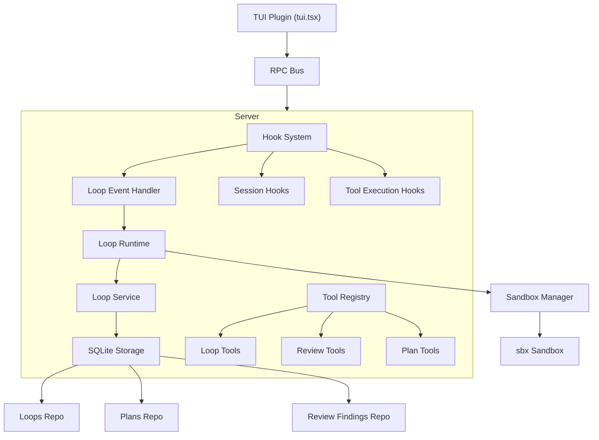

# OpenCode Forge Architecture

This document provides a high-level overview of the opencode-forge plugin architecture, including its module layout, hook system, storage layer, and initialization flow.

See also: [Loop System](loop-system.md), [Modules](modules.md), [API Reference](api/README.md).

## Plugin Architecture

OpenCode Forge is a dual-plugin: it exports both a server plugin (`src/index.ts`) and a TUI plugin (`src/tui.tsx`). The package declares both surfaces via the `oc-plugin` field in `package.json`.

```json
{
  "oc-plugin": ["server", "tui"]
}
```

| Export Path | Source File | Role |
|---|---|---|
| `.` / `./server` | `src/index.ts` | Server-side plugin: hooks, tools, agents, config |
| `./tui` | `src/tui.tsx` | TUI plugin: sidebar, plan viewer, execution panel |

### Server Plugin (`src/index.ts`)

The server plugin is the core of the plugin. It:

1. Initializes services (database, loop runtime, sandbox manager)
2. Registers tools for OpenCode to use
3. Registers hooks for session management and event handling
4. Manages the lifecycle of loops and sandbox containers

Plugin boot does not reconcile, recover, cancel, or restart any persisted loops. See [No boot-time loop recovery](#no-boot-time-loop-recovery) and the [Loop Lifecycle Rules](loop-system.md#loop-lifecycle-rules) for details.

Key exports:
- `createForgePlugin(config: PluginConfig): Plugin` - Factory function
- `createParentSessionLookup(options)` - Resolves parent sessions across worktrees
- `createSessionDirectoryLookup(options)` - Resolves session directory across worktrees
- `PluginConfig`, `CompactionConfig` - Configuration types
- `VERSION` - Plugin version

### Multi-client / multi-project

Each `opencode attach --dir <worktree>` invokes `createForgePlugin` once for that project, even when clients share the same `opencode serve` process.

- Storage remains project-keyed (SQLite rows include `projectId`), so no schema changes are required for multi-project isolation.
- Sandbox orphan cleanup is aware of all active worktrees before container cleanup.

### TUI Plugin (`src/tui.tsx`)

The TUI plugin provides a sidebar widget that displays:

- Active and recent loops
- Plan viewer with inline editing (view/edit/execute/export tabs)
- Execution dialog with mode, model, and variant selection
- Loop details dialog with session statistics
- Command palette integration (`Show loops`, `View plan`, `Execute plan`)
- Model selection dialog with recent model tracking

The TUI communicates with the server via RPC over the opencode bus using `tui.command.execute` events.

## Module Layout

The codebase is organized into these module groups under `src/`:

| Module | Purpose | Key Files |
|--------|---------|-----------|
| `agents/` | AI agent definitions (code, architect, auditor + auditor-loop variant) | `index.ts`, `code.ts`, `architect.ts`, `auditor.ts` |
| `hooks/` | Plugin event/lifecycle hooks (session, loop events, plan capture, plan approval, watchdog, sandbox, forge-session-attach, loop-permission, host-side-effects) | `index.ts`, `session.ts`, `loop.ts`, `plan-capture.ts`, `plan-approval.ts`, `watchdog.ts`, `sandbox-tools.ts`, `forge-session-attach.ts`, `loop-permission.ts`, `host-side-effects.ts` |
| `loop/` | Core loop state machine and runtime | `runtime.ts`, `service.ts`, `state.ts`, `transitions.ts`, `prompts.ts`, `restartability.ts`, `in-flight-guard.ts`, `token-usage.ts`, `name-uniqueness.ts` |
| `services/` | Higher-level orchestration services | `execution.ts`, `session-loop-resolver.ts`, `deterministic-decomposer.ts`, `plan-capture.ts`, `worktree-log.ts` |
| `sandbox/` | sbx sandbox management | `sbx.ts`, `manager.ts`, `context.ts`, `reconcile.ts` |
| `storage/` | SQLite persistence layer (repos + migrations) | `database.ts`, `repos/*.ts`, `migrations/*.sql` |
| `tools/` | Plugin tools callable by AI agents | `loop.ts`, `review.ts`, `plan-kv.ts`, `section-read.ts` |
| `workspace/` | Git worktree / workspace management | `forge-adapter.ts`, `forge-worktree.ts`, `pending-teardown.ts`, `classify-stale.ts`, `remove-with-context.ts`, `sweep-stale.ts` |
| `utils/` | Shared utility modules (~25 files) | `logger.ts`, `lru-cache.ts`, `model-fallback.ts`, etc. |
| `tui/` | TUI-specific components | `execute-plan-panel.tsx` |

All external consumers import through barrel files (`index.ts`) where available. See [Modules](modules.md) for full details.

## Loop System

The loop system provides autonomous iterative development with automatic auditing.

See [loop-system.md](loop-system.md) for detailed documentation.

### Components

- **Loop Runtime** (`src/loop/runtime.ts`) - Factory for creating Loop instances (`createLoop()` returns a `Loop` interface with ~50 methods)
- **Loop Service** (`src/loop/service.ts`) - State management for loops (DB-backed via SQLite)
- **State Machine** (`src/loop/state.ts`) - Discriminated union `LoopState` with 4 phases: `coding`, `auditing`, `final_auditing`, `post_action`
- **Transition Table** (`src/loop/transitions.ts`) - Pure `nextTransition()` function for phase transitions
- **Termination** (`src/loop/termination.ts`) - Termination reason mapping and status checks
- **Prompts** (`src/loop/prompts.ts`) - Prompt builders for each loop phase (continuation, audit, section)
- **Idle Gate** (`src/loop/idle-gate.ts`) - Session busy detection and timeout tracking
- **Section Summary** (`src/loop/section-summary.ts`) - Parse audit output markers
- **LoopEventHandler** (`src/hooks/loop.ts`) - Event handling, session rotation, watchdog integration

## Sandbox System

Sandbox is optional. When the `sbx` daemon is available and `sandbox.mode = 'sbx'` is configured, a sandbox is provisioned automatically; otherwise loops run in worktree-only mode.

### Components

- **SandboxRuntime** (`sandbox/sbx.ts`) - `sbx` CLI facade (create/exec/remove/list, availability probe)
- **SandboxManager** (`sandbox/manager.ts`) - Sandbox lifecycle management
- **SandboxContext** (`sandbox/context.ts`) - Tool call redirection
- **SandboxTools** (`hooks/sandbox-tools.ts`) - Hooks for sandbox integration

### How It Works

1. When a sandbox loop starts, an `sbx` sandbox is created
2. The worktree directory is mounted at its identical host path inside the sandbox
3. `bash` runs inside the sandbox; `glob` and `grep` results are produced inside the sandbox
4. File operations (`read`, `write`, `edit`) operate on the host directly
5. On loop completion, the sandbox is stopped and removed

### Tool Redirection

`bash` and the search tools reach the sandbox through two different mechanisms:

- **`bash`** is redirected out of band, not through a tool hook. The `config` hook points
  `cfg.shell` at the `forge-shell` shim (`sandbox/shell-shim.ts`) and the `shell.env` hook
  injects `FORGE_SANDBOX_CONTAINER`. The shim `exec`s `sbx exec -w "$PWD" <container> bash "$@"`.
  Tool arguments are never rewritten.
- **`glob` and `grep`** use output replacement. `tool.execute.before` runs the equivalent
  `rg` command inside the container and stores the result by `callID`; `tool.execute.after`
  overwrites `output.output` with it. Because `tool.execute.before` cannot cancel a tool call,
  the native host search still executes and its result is discarded. The before-hook rejects
  absolute paths outside the sandbox mounts, so that host execution stays confined to the
  mounted worktree.

## Hook System

OpenCode Forge integrates with OpenCode through several hook points. The plugin returns a standard `Hooks` object.

### Session Hooks (`src/hooks/session.ts`)

- `chat.message` - Inject memory into context, handle session events
- `experimental.session.compacting` - Custom compaction behavior for session continuity

### Message Transform Hooks (`src/index.ts`)

- `experimental.chat.messages.transform` - Appends a compact `<system-reminder>` to the last user message in interactive architect sessions, reinforcing stored-plan completion, warning-free structure, and canonical approval dispatch. Agent permissions separately deny filesystem mutation tools and `task` while retaining Bash for read-only inspection plus `plan-read`, `plan-write`, and `plan-edit`; the autonomous architect also cannot invoke execution, loop, or group tools.

### Tool Execution Hooks

- `tool.execute.before` - Sandbox tool redirection, logging (`src/hooks/sandbox-tools.ts`)
- `tool.execute.after` - Sandbox cleanup and output capture (`src/hooks/sandbox-tools.ts`)

### Loop Permission Patching (`src/hooks/loop-permission.ts`)

Loops are autonomous and cannot answer permission prompts, but OpenCode's default subagent ruleset falls back to `ask` for most tools. To prevent deadlocks, `createLoopPermissionRejectHook` listens for `session.created` events. When the new session resolves to an active loop, the hook calls `v2.session.update()` to overwrite the child session's `permission` ruleset:

- If the parent session has an allow-all ruleset (e.g. an auditor subagent), the parent's ruleset is inherited so the child stays under the same constraints.
- Otherwise the default loop ruleset from `buildLoopPermissionRuleset()` (`src/constants/loop.ts`) is applied — blanket allow-all inside the worktree, with explicit structural denies for `external_directory`, `review-write`, `review-delete`, `plan`, `plan_enter`, `plan_exit`, `plan-write`, `plan-edit`, `execute-plan`, `execute-goal`, `question`, `loop-cancel`, `loop-status`, `launch-group`, `group-status`, `group-cancel`. User-configured `loop.permissions` rules are layered in after the external-directory allows and before these structural denies (via `resolveLoopPermissionOptions`), so they can tailor user tools without overriding a structural deny.

A `PATCHED_SESSIONS` set deduplicates retries. Audit-only subagents use the stricter `buildAuditSessionPermissionRuleset()` (blanket allow-all with structural denies for the direct mutation tools `edit`/`write`/`multiedit`/`apply_patch`, plus the shared plan/loop structural denies).

### Event Hooks

- `event` - Handle server lifecycle events (e.g., `server.instance.disposed`)
- Plan approval events via `createPlanApprovalEventHook`
- Plan capture from streaming message parts and on assistant message completion via `createPlanCaptureEventHook`

### Additional Hooks

- **Plan Capture** (`src/hooks/plan-capture.ts`) - Captures the session plan of record. The primary authoring path is the `plan-write` / `plan-edit` tools, which write directly to the session-scoped `plans` row. Marker capture of `<!-- forge-plan:start -->...end-->` from assistant messages is the fallback path and runs both on streaming `message.part.updated` events and on assistant message completion (`message.updated`).
- **Forge Session Attach** (`src/hooks/forge-session-attach.ts`) - Automatically attaches loops when new sessions are created
- **Watchdog** (`src/hooks/watchdog.ts`) - Stall detection and recovery for loops

## Storage Architecture

OpenCode Forge uses `bun:sqlite` for all data persistence. The storage layer is organized into:

### Database (`src/storage/database.ts`)

- `initializeDatabase(dataDir, options)` - Creates SQLite DB in the data directory
- `closeDatabase()` - Closes database connections on shutdown
- `resolveDataDir()` - Resolves platform-appropriate data directory (`~/.local/share/opencode/forge`)
- Migrations are registered explicitly in execution order (ids 100-143; not every id ships a SQL file) and tracked in a `migrations` table

### Repository Pattern

All data access goes through typed repository interfaces created via factory functions:

| Repository | Purpose | Key Types |
|---|---|---|
| `LoopsRepo` | CRUD for loop rows | `LoopRow`, `LoopLargeFields` |
| `PlansRepo` | CRUD for plans (session-scoped plan of record read by `plan-read`, the approval hook, `execute-plan`, and the TUI plan dialog) | `PlanRow`, `PlansRepo` |
| `ReviewFindingsRepo` | CRUD for review findings | `ReviewFindingRow`, `ReviewFindingsRepo` |
| `SectionPlansRepo` | CRUD for milestone (section) plans used in decomposed loops | `SectionPlanRow`, `SectionPlansRepo` |
| `LoopTransitionsRepo` | Append-only loop phase-transition log | `LoopTransitionRow` |
| `PlanAmendmentsRepo` | Append-only audit trail of mid-loop plan amendments | `PlanAmendmentRow` |
| `LoopSessionUsageRepo` | Per-session token/cost usage across rotated loop sessions | `LoopSessionUsageRow`, `LoopUsageAggregate` |
| `TuiPrefsRepo` | TUI preferences persistence | `TuiPrefsRepo` |

Each repository is project-scoped via `projectId` parameter.

### Configuration

Plugin configuration is stored at `~/.config/opencode/forge-config.jsonc` (JSONC format). On first run, a bundled default config is copied if none exists.

## Service Initialization Order

The plugin follows this initialization sequence within `createForgePlugin()`:

1. **Logger** - Always first (`createLogger()`)
2. **v2 Client** - Create OpenCode v2 SDK client for API calls
3. **Sandbox Manager** - sbx sandbox management (optional, fails gracefully)
4. **Pending Teardown Registry** - Track worktree teardown contexts
5. **Workspace Status Registry** - Track workspace connected/disconnected state
6. **Workspace Adapter** - Register forge workspace adapter if experimental workspace API available
7. **Database** - Initialize SQLite storage (`initializeDatabase()`)
8. **Repositories** - Create typed repos (loops, plans, reviewFindings, sectionPlans, loopSessionUsage)
9. **Loop Event Handler** - Connect loop runtime to events and state management
10. **Tools and Agents** - Register all tools (`createTools()`) and agents (`buildAgents()`)
11. **Hooks** - Final registration of all hook points

### No boot-time loop recovery

Plugin initialization does not recover, cancel, or restart loops. Boot initializes storage and runtime services only. Loop continuation requires explicit user intent via `loop-status name=<loop> restart=true` (optionally `force=true` for a running loop). Stale forge workspaces are reclaimed by an opportunistic sweep on loop teardown (see `src/workspace/sweep-stale.ts`), not at boot. See [Loop Lifecycle Rules](loop-system.md#loop-lifecycle-rules) for the full restartability contract.

## Cleanup

On plugin shutdown (`server.instance.disposed` event):

1. Stop all active sandboxes
2. Terminate all active loops
3. Clear retry timeouts
4. Close database connections

## Data Flow


