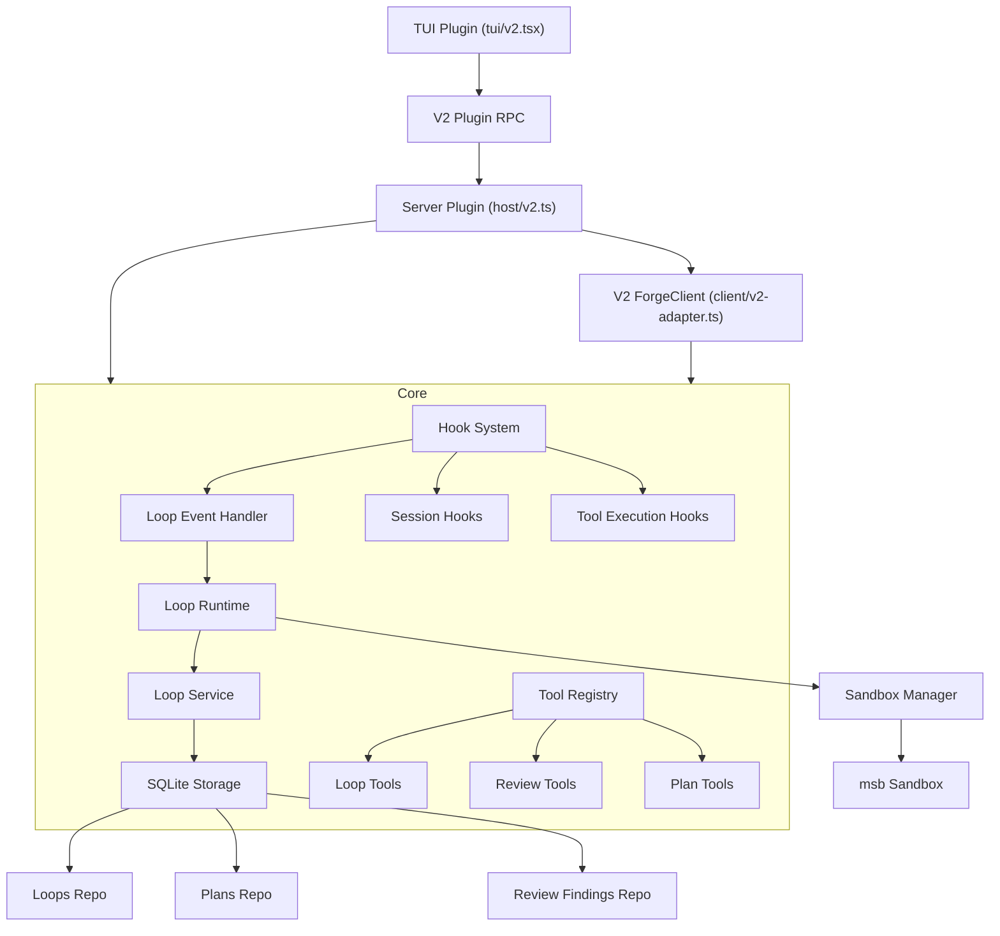

# OpenCode Forge Architecture

This document provides a high-level overview of the opencode-forge plugin architecture, including its module layout, hook system, storage layer, and initialization flow.

See also: [Loop System](loop-system.md), [Modules](modules.md), [API Reference](api/README.md).

## Plugin Architecture

OpenCode Forge is a plugin package: it exports a server plugin (`src/index.ts`) and a TUI plugin (`src/tui.tsx`). The package declares both surfaces via the `oc-plugin` field in `package.json`.

```json
{
  "oc-plugin": ["server", "tui"]
}
```

| Export Path | Source File | Role |
|---|---|---|
| `.` / `./server` | `src/index.ts` | Server-side plugin: hooks, tools, agents, config |
| `./tui` | `src/tui.tsx` | TUI plugin: sidebar, execution dialog, loop restart dialog |

### Entry points

`src/index.ts` default-exports the OpenCode 2.x module (`id` + `setup`) built with `define` from `@opencode/plugin/promise/plugin`; `src/tui.tsx` exports `{ id, setup }` for the V2 TUI surface in `src/tui/v2.tsx`. The server and TUI surfaces stay in separate entry files because OpenCode reads each export separately.

Both are thin adapters over one host-neutral core (`src/host/forge-core.ts`), so the loop runtime, storage, sandbox, and tools stay single-sourced:

| Surface | Adapter files | Role |
|---|---|---|
| Server | `src/host/v2.ts` | Runs `setup(ctx)`, registers tools/agents/commands/hooks, and pumps normalized events into the core |
| TUI | `src/tui/v2.tsx` | Registers the sidebar, execution dialog, loop restart, sandbox build, and host-sandbox toggle |

The server side is split by concern: `src/client/v2-adapter.ts` implements the `ForgeClient` port over the V2 context, `src/client/v2-workspaces.ts` adapts V2 worktrees and locations, `src/host/v2-events.ts` normalizes V2 events into Forge's event shape, and `src/host/v2-config.ts`, `src/host/v2-tools.ts`, and `src/host/v2-hooks.ts` handle agent/command registration, tool registration, and hooks.

### Server Plugin (`src/index.ts`)

The server plugin is the core of the plugin. It:

1. Initializes services (database, loop runtime, sandbox manager)
2. Registers tools for OpenCode to use
3. Registers agents and commands
4. Registers hooks for session management and event handling
5. Manages the lifecycle of loops and sandbox containers

Plugin boot does not reconcile, recover, cancel, or restart any persisted loops. See [No boot-time loop recovery](#no-boot-time-loop-recovery) and the [Loop Lifecycle Rules](loop-system.md#loop-lifecycle-rules) for details.

Key exports:
- `setupForgeV2(ctx: Plugin.Context)` - OpenCode 2.x `setup` entry
- `createParentSessionLookup(options)` - Resolves parent sessions across worktrees
- `createSessionDirectoryLookup(options)` - Resolves session directory across worktrees
- `PluginConfig`, `CompactionConfig` - Configuration types
- `VERSION` - Plugin version

### Multi-client / multi-project

Each `opencode attach --dir <worktree>` invokes `setupForgeV2` once for that project, even when clients share the same `opencode serve` process.

- Storage remains project-keyed (SQLite rows include `projectId`), so no schema changes are required for multi-project isolation.
- Sandbox orphan cleanup is aware of all active worktrees before container cleanup.

### TUI Plugin (`src/tui.tsx`)

The TUI plugin provides:

- A sidebar listing the project's loops (up to three: running first, then most recent finished)
- The current session's msb state next to the Forge title when sandboxing is configured
- An execution dialog with mode, model, and variant selection, also used to restart a loop
- Command palette integration (`Execute plan`, `Execute pasted plan`, `Restart loop`, `Open dashboard`, `Build sandbox template`, `Toggle host sandbox`)
- Model selection with recent-model tracking

The TUI talks to the server through the V2 plugin RPC port (`FORGE_RPC`): `executePlan` for plan launches, plus a `toast`/`sessionDelete` event bus for server-pushed notifications.

## Module Layout

The codebase is organized into these module groups under `src/`:

| Module | Purpose | Key Files |
|--------|-----------|-----------|
| `host/` | Host-neutral core plus the V2 adapter | `forge-core.ts`, `v2.ts`, `v2-events.ts`, `v2-hooks.ts`, `v2-tools.ts`, `v2-config.ts`, `forge-rpc.ts` |
| `client/` | `ForgeClient` port and the V2 adapter | `port.ts`, `v2-adapter.ts`, `v2-workspaces.ts`, `errors.ts` |
| `agents/` | AI agent definitions (code, architect, auditor + auditor-loop variant) | `index.ts`, `code.ts`, `architect.ts`, `auditor.ts` |
| `hooks/` | Plugin event/lifecycle hooks (session, loop events, plan capture, plan approval, watchdog, sandbox, forge-session-attach, loop-permission, host-side-effects, group orchestrator) | `index.ts`, `session.ts`, `loop.ts`, `plan-capture.ts`, `plan-approval.ts`, `watchdog.ts`, `sandbox-tools.ts`, `sandbox-message.ts`, `forge-session-attach.ts`, `loop-permission.ts`, `host-side-effects.ts`, `group-orchestrator.ts`, `tool-hook-types.ts` |
| `loop/` | Core loop state machine and runtime | `runtime.ts`, `service.ts`, `state.ts`, `transitions.ts`, `prompts.ts`, `restartability.ts`, `in-flight-guard.ts`, `token-usage.ts`, `name-uniqueness.ts` |
| `services/` | Higher-level orchestration services | `execution.ts`, `session-loop-resolver.ts`, `deterministic-decomposer.ts`, `section-bootstrap.ts`, `plan-capture.ts`, `group-orchestrator.ts`, `group-scheduler.ts`, `tui-loop-restart-controller.ts`, `unified-sandbox-resolver.ts`, `worktree-log.ts` |
| `sandbox/` | msb sandbox management | `msb.ts`, `manager.ts`, `context.ts`, `reconcile.ts`, `session-controller.ts`, `shell-shim.ts`, `exec-fs.ts`, `env-probe.ts`, `process.ts`, `template.ts` |
| `storage/` | SQLite persistence layer (repos + migrations) | `database.ts`, `repos/*.ts`, `migrations/*.sql` |
| `tools/` | Plugin tools callable by AI agents | `loop.ts`, `review.ts`, `plan-kv.ts`, `plan-authoring.ts`, `plan-adjust.ts`, `section-read.ts`, `group.ts`, `tool.ts` |
| `workspace/` | Git worktree / workspace management | `forge-adapter.ts`, `forge-worktree.ts`, `forge-naming.ts`, `forge-workspace-metadata.ts`, `pending-teardown.ts`, `worktree-commit.ts`, `worktree-opencode-config.ts`, `classify-stale.ts`, `remove-with-context.ts`, `sweep-stale.ts` |
| `utils/` | Shared utility modules (~40 files) | `logger.ts`, `lru-cache.ts`, `model-fallback.ts`, `git-service.ts`, `toast.ts`, etc. |
| `tui/` | TUI-specific components | `v2.tsx`, `host.tsx`, `execute-plan-panel.tsx`, `plan-commands.ts`, `host-sandbox.ts`, `session-sandbox-store.ts`, `sandbox-build-dialog.tsx`, `session-follow.ts`, `project-client.ts`, `v2-client.ts`, `options.ts` |

All external consumers import through barrel files (`index.ts`) where available. See [Modules](modules.md) for full details.

## Loop System

The loop system provides autonomous iterative development with automatic auditing.

See [loop-system.md](loop-system.md) for detailed documentation.

### Components

- **Loop Runtime** (`src/loop/runtime.ts`) - Factory for creating Loop instances (`createLoop()` returns a `Loop` interface with ~50 methods)
- **Loop Service** (`src/loop/service.ts`) - State management for loops (DB-backed via SQLite)
- **State Machine** (`src/loop/state.ts`) - Discriminated union `LoopState` with 4 phases: `coding`, `auditing`, `final_auditing`, `post_action`
- **Transition Table** (`src/loop/transitions.ts`) - Pure `nextTransition()` function for phase transitions
- **Termination** (`src/loop/termination.ts`) - Termination reason mapping and status checks
- **Prompts** (`src/loop/prompts.ts`) - Prompt builders for each loop phase (continuation, audit, section)
- **Idle Gate** (`src/loop/idle-gate.ts`) - Session busy detection and timeout tracking
- **Section Summary** (`src/loop/section-summary.ts`) - Parse audit output markers
- **LoopEventHandler** (`src/hooks/loop.ts`) - Event handling, session rotation, watchdog integration

## Sandbox System

Sandbox is optional and controlled by `sandbox.enabled` (default `true`) with driver `sandbox.mode = 'msb'`. When enabled, a sandbox is provisioned automatically. If the `msb` CLI is unavailable or the host cannot run microVMs, sandbox startup fails and the loop is rolled back rather than falling back to the host; set `sandbox.enabled: false` to run worktree-only.

### Components

- **SandboxRuntime** (`sandbox/msb.ts`) - `msb` CLI facade (create/exec/remove/list, availability probe)
- **SandboxManager** (`sandbox/manager.ts`) - Sandbox lifecycle management
- **SandboxContext** (`sandbox/context.ts`) - Tool call redirection
- **SandboxTools** (`hooks/sandbox-tools.ts`) - Hooks for sandbox integration
- **SandboxMessage** (`hooks/sandbox-message.ts`) - Tells the agent its tool calls run in a container
- **SessionSandboxController** (`sandbox/session-controller.ts`) - Host-session sandbox selection and reconciliation
- **Shell shim** (`sandbox/shell-shim.ts`) - Generated shim routing the native `shell` tool through `msb exec`

### How It Works

1. When a sandbox loop starts, an `msb` sandbox is created
2. The worktree directory is mounted at its identical host path inside the sandbox
3. Shell commands and search tools run inside the sandbox: `shell` through the generated shell shim, `glob` and `grep` through the sandbox tool hooks — both backed by `msb exec`
4. File operations (`read`, `write`, `edit`, `patch`) operate on the host directly, fenced by the sandbox tool hook to the sandbox mounts (read-only mounts refuse mutation)
5. On loop completion, the sandbox is stopped and removed

### State Model

The sandbox state model has five states. `running` and `stopped` are both usable: msb suspends idle microVMs to `stopped` and `msb exec` resumes them in place, so forge never recreates a merely-stopped sandbox. `transient` covers msb's `Created`/`Starting`/`Draining`/`Paused` statuses — real but not directly executable, and never collapsed into `unknown`. `unknown` means the state query failed and says nothing about the sandbox, so forge fails closed and refuses to create or remove on that basis. `missing` is the one confirmed-absent state, and the only one in which forge creates a sandbox.

### Tool Redirection

`shell` and the search tools reach the sandbox through two different mechanisms:

- **`shell`** is redirected out of band, not through a tool hook. For a sandboxed session
  the tool wrapper prefixes the command with a one-off `forge-sandbox-required-<uuid> && ` marker;
  the `shell.hook('create.before')` strips the marker, points `event.shell` at the
  `forge-shell` shim (`sandbox/shell-shim.ts`), and sets `FORGE_SANDBOX_CONTAINER`. The shim
  `exec`s `msb exec --quiet "$FORGE_SANDBOX_CONTAINER" --no-tty -w "$PWD" -- bash "$@"`.
  Tool arguments are never rewritten, and an unstripped marker fails with "command not found".
- **`glob` and `grep`** use output replacement. `tool.hook('execute.before')` runs the equivalent
  `rg` command inside the container and stores the result by `callID`; `tool.hook('execute.after')`
  overwrites `output.output` with it. Because the before-hook cannot cancel a tool call,
  the native host search still executes and its result is discarded. The before-hook rejects
  absolute paths outside the sandbox mounts, so that host execution stays confined to the
  mounted worktree.

## Hook System

OpenCode Forge integrates with OpenCode through several hook points. `setup(ctx)` registers the core handlers through V2's hook API.

### Hooks (`src/host/v2-hooks.ts`)

The V2 adapter registers the shared core handlers through V2's hook API:

- `tool.hook('execute.before')` / `tool.hook('execute.after')` — sandbox tool redirection and logging, with V2 tool names (`shell`, `subagent`) mapped back to Forge's names (`bash`, `task`)
- `shell.hook('create.before')` — sandbox shell routing, keyed by the loop worktree location or the one-off sandbox marker
- `session.hook('prompt')` — plan capture from submitted prompts
- `session.hook('context')` — system context injection and the architect reminder
- `session.hook('compaction')` — compaction instructions

### Session Hooks (`src/hooks/session.ts`)

- `session.hook('prompt')` - Inject memory into context, handle session events
- `session.hook('compaction')` - Custom compaction behavior for session continuity

### Architect Reminder (`session.hook('context')`)

`src/host/v2-hooks.ts` appends a compact `<system-reminder>` to the last user message in interactive architect sessions, reinforcing stored-plan completion, warning-free structure, and canonical approval dispatch. Agent permissions separately deny filesystem mutation tools and `subagent` while retaining the shell tool for read-only inspection plus `plan-read`, `plan-write`, and `plan-edit`; the autonomous architect also cannot invoke execution, loop, or group tools.

### Tool Execution Hooks

- `tool.execute.before` - Sandbox tool redirection, logging (`src/hooks/sandbox-tools.ts`)
- `tool.execute.after` - Sandbox cleanup and output capture (`src/hooks/sandbox-tools.ts`)

### Loop Permission Patching (`src/hooks/loop-permission.ts`)

Loops are autonomous and cannot answer permission prompts, but OpenCode's default subagent ruleset falls back to `ask` for most tools. To prevent deadlocks, `createLoopPermissionPatcher` listens for `session.created` events. When the new session resolves to an active loop, the hook calls `v2.session.update()` to overwrite the child session's `permission` ruleset:

- If the parent session has an allow-all ruleset (e.g. an auditor subagent), the parent's ruleset is inherited so the child stays under the same constraints.
- Otherwise the default loop ruleset from `buildLoopPermissionRuleset()` (`src/constants/loop.ts`) is applied — blanket allow-all inside the worktree (external directories included; in a sandbox the mounts are the boundary), and explicit structural denies for `review-write`, `review-delete`, `plan-write`, `plan-edit`, `execute-plan`, `execute-goal`, `question`, `loop-cancel`, `loop-status`, `launch-group`, `group-status`, `group-cancel`. User-configured `loop.permissions` rules are layered in after the blanket allow and before these structural denies (via `resolveLoopPermissionOptions`), so they can tailor user tools without overriding a structural deny.

A `PATCHED_SESSIONS` set deduplicates retries. Audit-only subagents use the stricter `buildAuditSessionPermissionRuleset()` (blanket allow-all with structural denies for the direct mutation tools `edit`/`write`, plus the shared plan/loop structural denies).

### Event Hooks

- `onEvent` - Handle normalized events (session execution, session creation, session deletion)
- `location.shutdown` - Run cleanup when the location shuts down
- Plan approval events via `createPlanApprovalEventHook`
- Plan capture from streaming message parts via `createPlanCaptureEventHook`

### Additional Hooks

- **Plan Capture** (`src/hooks/plan-capture.ts`) - Captures the session plan of record. The primary authoring path is the `plan-write` / `plan-edit` tools, which write directly to the session-scoped `plans` row. Marker capture of `<!-- forge-plan:start -->...end-->` from assistant messages is the fallback path and runs on streaming `message.part.updated` events.
- **Forge Session Attach** (`src/hooks/forge-session-attach.ts`) - Automatically attaches loops when new sessions are created
- **Watchdog** (`src/hooks/watchdog.ts`) - Stall detection and recovery for loops
- **Group Orchestrator** (`src/hooks/group-orchestrator.ts`) - Advances queued features when a group loop terminates

## Storage Architecture

OpenCode Forge uses `bun:sqlite` for all data persistence. The storage layer is organized into:

### Database (`src/storage/database.ts`)

- `initializeDatabase(dataDir, options)` - Creates SQLite DB in the data directory
- `closeDatabase()` - Closes database connections on shutdown
- `resolveDataDir()` - Resolves platform-appropriate data directory (`~/.local/share/opencode/forge`)
- Migrations are registered explicitly in execution order (ids 100-143; not every id ships a SQL file) and tracked in a `migrations` table

### Repository Pattern

All data access goes through typed repository interfaces created via factory functions:

| Repository | Purpose | Key Types |
|---|---|---|
| `LoopsRepo` | CRUD for loop rows | `LoopRow`, `LoopLargeFields` |
| `PlansRepo` | CRUD for plans (session-scoped plan of record read by `plan-read`, the approval hook, `execute-plan`, and the TUI plan dialog) | `PlanRow`, `PlansRepo` |
| `ReviewFindingsRepo` | CRUD for review findings | `ReviewFindingRow`, `ReviewFindingsRepo` |
| `SectionPlansRepo` | CRUD for milestone (section) plans used in decomposed loops | `SectionPlanRow`, `SectionPlansRepo` |
| `LoopTransitionsRepo` | Append-only loop phase-transition log | `LoopTransitionRow` |
| `PlanAmendmentsRepo` | Append-only audit trail of mid-loop plan amendments | `PlanAmendmentRow` |
| `LoopSessionUsageRepo` | Per-session token/cost usage across rotated loop sessions | `LoopSessionUsageRow`, `LoopUsageAggregate` |
| `FeatureGroupsRepo` | Feature-group state for grouped execution | `FeatureGroupsRepo` |
| `LoopAttemptsRepo` | Durable audit-attempt history | `LoopAttemptsRepo` |
| `SessionSandboxPreferencesRepo` | Desired/applied host-session sandbox state | `SessionSandboxPreferencesRepo` |
| `TuiLoopRestartRepo` | TUI loop-restart request/acknowledgement handoff | `TuiLoopRestartRepo` |

Each repository is project-scoped via `projectId` parameter.

### Configuration

Plugin configuration is stored at `~/.config/opencode/forge-config.jsonc` (JSONC format). On first run, a bundled default config is copied if none exists.

## Service Initialization Order

The plugin follows this initialization sequence within `createForgeCore()`:

1. **Logger** - Always first (`createLogger()`)
2. **Sandbox Manager** - msb sandbox management (optional; initialization fails the plugin when sandboxing is enabled)
3. **Pending Teardown Registry** - Track worktree teardown contexts
4. **Workspace Adapter** - Register the forge workspace adapter
5. **Database** - Initialize SQLite storage (`initializeDatabase()`)
6. **Repositories** - Create typed repos (loops, plans, reviewFindings, sectionPlans, loopSessionUsage, featureGroups, transitions, planAmendments, attempts, sessionSandboxPreferences, tuiLoopRestart)
7. **Loop Event Handler** - Connect loop runtime to events and state management
8. **Session Sandbox Controller** - Reconcile the host-session sandbox selection
9. **Group Orchestrator** - Manage grouped execution
10. **Tools and Agents** - Register all tools (`createTools()`) and agents (`buildAgents()`)
11. **Hooks** - Final registration of all hook points

### No boot-time loop recovery

Plugin initialization does not recover, cancel, or restart loops. Boot initializes storage and runtime services only. Loop continuation requires explicit user intent via `loop-status name=<loop> restart=true` (optionally `force=true` for a running loop). Stale forge workspaces are reclaimed by an opportunistic sweep on loop teardown (see `src/workspace/sweep-stale.ts`), not at boot. See [Loop Lifecycle Rules](loop-system.md#loop-lifecycle-rules) for the full restartability contract.

## Cleanup

On plugin shutdown (`location.shutdown` event):

1. Release the shared session-sandbox controller
2. Stop all active sandboxes
3. Clear retry timeouts
4. Close database connections

## Data Flow


