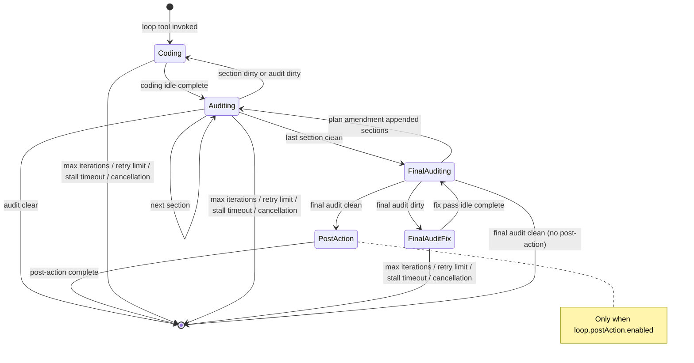
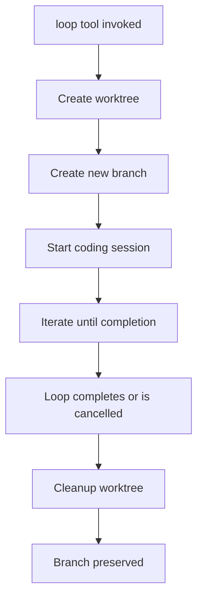

# Loop System Documentation

The loop system provides autonomous iterative development with automatic code auditing.

## Loop Lifecycle Rules

### Plugin Boot Behavior

- **Plugin boot does not mutate loop rows.** Initialization loads storage and runtime services only.
- No loops are recovered, cancelled, restarted, or reconciled during plugin startup.
- Loop recovery and restart are explicit user actions via `loop-status restart=true`.

### Restartability

- **Any non-completed loop is restartable** via explicit restart.
- Restartable statuses: `running`, `cancelled`, `errored`, `stalled`.
- **Completed loops are history-only** and cannot be restarted.
- **Worktree-backed loops** (`worktree: true`, e.g. `/execute-plan` `mode: loop`, `/execute-goal`): restart refuses only when the worktree directory is gone AND its `forge/<loop-name>` branch is also gone. The scratch branch is never deleted by Forge, so a missing worktree does not normally block restart — `handleLoopRestart` recreates the worktree from the surviving branch (`git worktree add`). Only when both are gone is the work unrecoverable.
- **Project-directory goal loops** (`worktree: false`, e.g. `/execute-plan` `mode='new-session'`): there is no worktree to require — restart runs in the project directory directly and is not blocked by any missing worktree path.

### Restart Semantics

- Restart preserves loop identity, plan (or goal text), section progress, and review findings.
- Worktree-backed loops also preserve the worktree path and `forge/<loop-name>` branch; project-directory goal loops have neither and resume in the project directory.
- Restart resets iteration count and error budget.
- Restart creates a fresh session and resumes from the persisted section index. The persisted phase is preserved for `final_auditing` and `post_action`; `coding` and `auditing` restart as a fresh `coding` pass, and `final_audit_fix` also restarts as `coding` (a fix pass is a coding pass, not an auditor phase), with the final-audit findings re-prompted from the persisted `lastAuditResult`.

### Stale Workspace Sweep

- Stale workspace sweep is **teardown cleanup-only**, not boot-time recovery.
- Sweep removes workspace registrations for non-running restartable loops (`cancelled`, `errored`, `stalled`) while preserving worktrees for manual restart.
- Completed loops are fully removed (registration + worktree).
- Running loops are never touched by sweep.

## Loop Lifecycle



## Loop States

Each loop has a `LoopState` backed by the typed `loops` and `loop_large_fields` SQLite tables:

```typescript
interface LoopState {
  active: boolean                    // Whether loop is currently running
  sessionId: string                  // Current OpenCode session ID
  loopName: string                   // Unique loop identifier
  worktreeDir: string                // Worktree path for worktree-backed loops; for project-directory goal loops (`worktree:false`, e.g. `execute-plan` `mode='new-session'`) this is the project directory, not a worktree
  projectDir?: string                // Project directory path (set on both worktree and project-directory loops; on worktree loops it is the host project, on project-directory goal loops it mirrors `worktreeDir`)
  worktreeBranch?: string            // Branch name if using worktree
  iteration: number                  // Current iteration count
  maxIterations: number              // Maximum iterations (0 = unlimited)
  startedAt: string                  // ISO timestamp
  prompt?: string                    // Original task prompt
  phase: 'coding' | 'auditing' | 'final_auditing' | 'final_audit_fix' | 'post_action'
  lastAuditResult?: string           // Last audit output
  errorCount: number                 // Consecutive error count
  auditCount: number                 // Number of audits completed
  terminationReason?: string         // Reason for termination
  completedAt?: string               // ISO timestamp
  worktree?: boolean                 // Whether using worktree isolation
  modelFailed?: boolean              // Whether model error occurred
  sandbox?: boolean                  // Whether using Docker sandbox
  sandboxContainer?: string          // Container name if sandboxed
  completionSummary?: string         // Summary of loop completion
  executionModel?: string            // Model used for execution
  auditorModel?: string              // Model used for auditing
  workspaceId?: string               // OpenCode workspace ID
  hostSessionId?: string             // Host session ID; redirect target for worktree loops (worktree:true), correlation/source metadata only for worktree:false goal loops
  currentSectionIndex: number
  totalSections: number
  finalAuditDone: boolean
  kind?: 'plan' | 'goal'             // Discriminator: plan loops persist a plan; goal loops persist goal text
  goal?: string                      // Goal text for goal loops (undefined for plan loops)
}
```

## Session Rotation

Each iteration runs in a **fresh session** to keep context small and prioritize speed:

1. **Coding phase** completes
2. Current session is destroyed
3. New session is created
4. Continuation prompt is injected with:
   - Original task prompt
   - Current iteration number
   - Audit findings (if any)

```typescript
function buildContinuationPrompt(state: LoopState, auditFindings?: string): string {
  let systemLine = `Loop iteration ${state.iteration}`

  if (state.maxIterations > 0) {
    systemLine += ` / ${state.maxIterations}`
  } else {
    systemLine += ` | No max iterations set - loop runs until auditor all-clear or cancelled`
  }

  let prompt = `[${systemLine}]\n\n${state.prompt ?? ''}`

  if (auditFindings) {
    prompt += `\n\n---\nThe code auditor reviewed your changes. You MUST address all bugs and convention violations.`
  }

  return prompt
}
```

## Usage Tracking

Loop usage is captured across rotated code and auditor sessions so `loop-status` can report cumulative cost and token totals after the original session has been replaced.

- `token-usage.ts` extracts assistant message usage, normalizes token fields, and groups totals by model label.
- `loop_session_usage` persists per-session, per-model rows keyed by project, loop name, session ID, and role.
- `loop-status <name>` merges persisted rows with the currently live session output while avoiding double-counting the active session.
- When no loops are active, `loop-status` can still show cumulative usage for completed loops that have persisted usage data.

Tracked token buckets are input, output, reasoning, cache read, and cache write, plus cost and assistant message count.

## Stall Detection

A watchdog monitors loop activity. If no progress is detected within `stallTimeoutMs` (default: 60 seconds), the current phase is re-triggered.

```typescript
const STALL_TIMEOUT_MS = 60_000
const MAX_CONSECUTIVE_STALLS = 5
```

After 5 consecutive stalls, the loop terminates with `terminationReason: 'stall_timeout'`.

## Review Finding Persistence

Audit findings survive session rotation via the **review store**:

```typescript
interface ReviewFinding {
  projectId: string
  file: string
  line: number
  severity: 'bug' | 'warning'
  description: string
  scenario: string | null
  loopName: string | null
  sectionIndex: number | null
  createdAt: number
}
```

At the start of each audit:
1. Existing findings are retrieved via `review-read`
2. Resolved findings are deleted via `review-delete`
3. Unresolved findings are carried forward

Completion rules depend on the loop kind:

- **Plan loops** (`execute-plan` `mode: loop`, `launch-group`): outstanding `severity: 'bug'` findings block completion. The loop terminates only when the auditor has run at least once and zero bug-severity findings remain; warnings may persist without blocking.
- **Goal loops** (`execute-goal`, `execute-plan` `mode: 'new-session'`): a completed auditor pass must leave zero outstanding review findings of any severity — both bugs and warnings block completion. See [Goal Loops](#goal-loops).

## Worktree Isolation

Worktree loops run in an isolated git worktree. Sandbox is optional: when Docker is available and `sandbox.mode = 'docker'` is configured, a sandbox container is provisioned automatically; otherwise the loop runs in worktree-only mode.

Worktree loops require a repository with at least one commit. If OpenCode started before the initial commit, it resolves the project as `global`; create the commit, restart OpenCode, and retry. Forge rejects `execute-plan` loop mode, `execute-goal`, local or remote TUI loop launch, and feature-group launch/restart before creating workspaces, sessions, or group state when this precondition is not met.

> Note: this applies to the `execute-plan` tool's default `mode: loop`. The same tool also accepts `mode: new-session`, which runs the plan as an audited goal-style loop in a fresh session in the project directory (no worktree, no sandbox); the auditor validates each coding pass and the loop continues until the audit is clear. It is tracked by `loop-status` and `loop-cancel`, and falls back to a plain standalone one-shot session when loops are disabled or the project has no commit (see [Tools Reference](tools.md#execute-plan)).



When a workspace carries a SHA pin (`extra.startRef`, set by remote loop launches), the new branch is created from that exact commit instead of the clone's current `HEAD`. If the commit is not present locally, the adapter fetches the sync ref (`extra.syncRef`, default `refs/forge/<loopName>`) from the configured git remote first, and fails with a descriptive error when the SHA still cannot be resolved. If the loop branch already exists, its tip must match the pinned SHA — a leftover same-named branch at a different commit fails creation with an actionable error instead of silently running old code (unpinned workspaces still reuse existing branches). On final teardown the sync ref is deleted from the shared git remote. See [Configuration → Remotes](configuration.md#remotes).

Benefits of worktree isolation:
- Isolation from ongoing development
- Safe to experiment without affecting main branch
- Branch preserved for later review/merge
- Per-loop customization via `loop.worktreeOpencodeConfig` — inject MCP servers and other [opencode config](https://opencode.ai/config.json) into each worktree without host config changes or commit pollution (see [Configuration Reference](configuration.md#worktree-opencode-config))

## Sandbox Integration

Sandbox is optional. When Docker is available and configured, a sandbox container is provisioned automatically; otherwise loops run in worktree-only mode.

1. Container created with worktree mounted at `/workspace`
2. `bash`, `glob`, `grep` tools redirect into container
3. `read`/`write`/`edit` operate on host filesystem
4. Container stopped and removed on loop completion

See [sandbox documentation](architecture.md#sandbox-system) for details.

## Milestones (aka sections)

In user-facing language, a plan is decomposed into **milestones** — ordered units of execution. In the code and database, these are called **sections**:

- `section_plans` SQL table — one row per milestone, ordered by `sectionIndex`
- `currentSectionIndex` / `totalSections` columns on the loop row
- `<!-- forge-section -->` markers in the architect plan output
- `section-read` tool reads the current or specified milestone

Decomposition is a one-shot preprocessing step at loop start (`services/deterministic-decomposer.ts`), not a runtime loop phase. Once milestones exist, the loop advances through them via `advance-section` transitions inside the `auditing` phase. When the `final_auditing` phase reports outstanding bug findings, the loop rotates to a coding session in the persisted `final_audit_fix` phase — the code agent fixes the reported findings without rewinding to a specific section, and on idle the loop transitions straight back to `final_auditing` for re-verification. A loop stopped mid-fix restarts as a coding pass that re-sends the final-audit fix prompt (rebuilt from the persisted `lastAuditResult`).

### Plan Amendments

After decomposition, the *remaining* (not yet started) milestones can still be amended mid-loop: during a section audit, the auditor may call the `plan-adjust` tool to replace the pending section suffix when completed work makes the remaining sections unable to achieve the plan objective as written. The objective and verification criteria are immutable, completed/current sections cannot be changed, goal loops are excluded, and the resulting total is capped at 24 sections. Every amendment is recorded in the `plan_amendments` table with before/after snapshots and a rationale. If an amendment appends sections while the loop is already in `final_auditing`, the loop reverts to `auditing` to execute them.

### Transition Log

Every persisted phase change appends exactly one row to the `loop_transitions` table (event type, transition kind, from/to phase, iteration, section index, and terminal status/reason for terminate rows). The dashboard renders this log as a live state-machine graph with per-edge traversal counts. Transition history survives loop restarts (loop rows are restored in place, never delete+reinserted) but is removed with the loop row by the terminal-loop sweep.

## Completion Conditions

A loop completes when the active phase emits a clean audit result (optionally followed by a post-completion action phase):

- Non-sectioned loops complete on `audit-clear`.
- Sectioned loops advance through clean section audits, then complete on `final-audit-clean`.
- Dirty section audits rotate back to coding for the same section so findings can be addressed.
- Dirty final audits rotate to a coding session in the `final_audit_fix` phase (no section rewind); when the fix coding pass goes idle, the loop returns straight to `final_auditing`.
- After a clean final audit, if `loop.postAction.enabled` is `true` and specifies a `skill` or `prompt`, the loop enters a `post_action` phase that runs inside the worktree before teardown. Completion occurs when the post-action session goes idle (`post-action-complete` event).

## Post-Completion Action Phase

After a clean final audit, before worktree teardown, the loop may run a **post-completion action** configured via `loop.postAction` in `forge-config.jsonc`. This phase is best-effort — it is not re-audited and relies only on safe, scoped fixes. The post-action runs as the `code` agent in a fresh session inside the worktree.

```jsonc
{
  "loop": {
    "postAction": {
      "enabled": false,       // Enable the post-completion action phase
      "skill": "pr-review",   // Skill to load via the Skill tool (e.g. "pr-review")
      "prompt": "..."         // Extra instruction text; used standalone when no skill is set
    }
  }
}
```

### Configuration

| Field | Type | Default | Description |
|-------|------|---------|-------------|
| `loop.postAction.enabled` | `boolean` | `false` | Enable the post-completion action phase. |
| `loop.postAction.skill` | `string` | — | Name of a skill to load via the Skill tool at action time (e.g. `"pr-review"`). Must be installed host-side. |
| `loop.postAction.prompt` | `string` | — | Optional extra instruction text appended to the action prompt. Used standalone when no skill is set. |

### Behavior

- Runs only after a clean final audit completes.
- Runs **inside the worktree** as the `code` agent, with access to the full worktree state (including uncommitted changes).
- **Best-effort:** The post-action result is not re-audited; it applies only safe, scoped fixes. The question tool is blocked — any finding requiring clarification is auto-deferred.
- On idle (`post-action-complete`), the loop terminates normally.
- If the post-action session fails to create, the loop terminates as completed without retrying.
- **Outcome capture:** On `post-action-complete`, the post-action session's raw final assistant message is stored verbatim in the loop's `completion_summary` (surfaced as **Completion Summary** in the dashboard). The loop status is **always** `completed` regardless of what the post-action reported — the plan itself was already cleared by the final audit; the summary only provides context (alternate-review verdict, CI result, etc.). Completion summary is captured only on the clean `post-action-complete` path; idle-exhausted, error, and abort-without-assistant terminations leave it empty.

## Cancellation

Loops can be cancelled via:
- `loop-cancel` tool
- `/loop-cancel` slash command

Cancellation:
1. Marks loop as inactive
2. Sets `terminationReason` to `'cancelled'`
3. Stops sandbox container if applicable
4. Optionally cleans up worktree (if `cleanupWorktree: true`)

## Error Handling

| Error Type | Behavior |
|------------|----------|
| Model error | Automatic fallback to default model, retry |
| Error retry limit | Loop terminates with `terminationReason: 'error_max_retries'` |
| Audit retry limit | Loop terminates with `terminationReason: 'audit_retry_exhausted'` |
| Final audit retry limit | Loop terminates with `terminationReason: 'final_audit_retry_exhausted'` |
| Stall timeout | Loop terminates with `terminationReason: 'stall_timeout'` after the configured consecutive stall limit |

## Goal Loops

A **goal loop** (`kind: 'goal'`) is a lightweight alternative to a plan loop: it skips decomposition, sections, `final_auditing`, and `post_action`. Inputs range from a free-text goal (`/execute-goal`) to a structured plan (`execute-plan` `mode: 'new-session'`); the loop itself never decomposes the input and treats whatever it receives as the single goal text. The structured-plan entry path is approved upstream **only** when launched through the architect's plan-approval flow or the TUI panel — a direct `execute-plan` tool call skips approval and treats the supplied plan as authoritative scope. See [Entry paths and execution location](#entry-paths-and-execution-location) below for how the two entry paths differ in input, approval, working directory, and completion behavior.

### Entry paths and execution location

Goal loops originate from two entry paths that share the same runtime, auditor, and completion rule but execute in different locations:

- **`/execute-goal <prompt>`** slash command (or the `execute-goal` tool). Runs in an isolated git **worktree**, like plan loops. Requires a committed repository; rejects with the precondition error otherwise.
- **`/execute-plan` with `mode='new-session'`** (the execute-plan tool, the plan-approval **New session** button, and the TUI panel's New session launch). Runs **in the project directory** with `worktree:false` — no worktree, no sandbox, no workspace — as an audited goal-style loop. Completion does **not** unwarp the TUI to a host session: teardown returns early for `worktree:false` loops, so the TUI stays on the executor session. `hostSessionId` is recorded only as correlation metadata (and as the one-shot fallback attribution source), not as a redirect target. Falls back to a plain standalone one-shot session only when loops are disabled or the project has no commit (see [Tools Reference](tools.md#execute-plan)).

Both entry paths persist `kind: 'goal'` and use the same auditor; only the persisted `worktree` flag (and therefore the executor session's working directory) differs.

### Input and approval (entry-path-specific)

The two entry paths share the goal-loop runtime below but differ in how input is produced, approved, and stored:

- **`/execute-goal <prompt>`** — free-text goal supplied directly via the slash command or `execute-goal` tool arg. There is **no plan, no decomposition, and no approval** — the goal text is the authoritative scope. It is persisted in `loop_large_fields.goal` and is never written to the `plans` table.
- **`/execute-plan` with `mode='new-session'`** — a structured plan supplied as the loop's goal. The plan enters through one of three launch paths: (1) the plan-approval `question` flow (the architect's **New session** button), where the plan was reviewed and approved upstream; (2) the TUI panel's New session launch, which drives the same approved plan into the audited path; or (3) a direct `execute-plan` tool call, where the caller supplies the plan inline via the `plan` argument or references a stored plan — **no approval check is performed for direct calls**, and the supplied text is treated as authoritative scope. The plan text is captured from the session plan store into the `plans` table with the `<!-- forge-plan:start -->` / `<!-- forge-plan:end -->` markers **stripped** (the capture parser keeps only the content between the markers); inline `plan` arguments are persisted verbatim. Whatever plan text becomes the loop's goal (persisted in `loop_large_fields.goal`) is run as a **goal-style loop** — no section decomposition, no `final_auditing`, no `post_action` — regardless of how it entered.

### Lifecycle differences from plan loops

The runtime behavior below is shared by both entry paths; only the input/approval flow above differs.

- **No decomposition, no sections, no final audit, no post-action.** The goal text (free-text or structured plan) is persisted in `loop_large_fields.goal` and is the auditor's authoritative scope. There are no sections, no `final_auditing` phase, and no `post_action` phase. (An `execute-plan` `mode='new-session'` plan may also be stored in the `plans` table because it was captured there pre-launch — with Forge markers stripped — but the goal loop never reads it back for decomposition.)
- **Dedicated rotating sessions.** Forge creates a code session — in the isolated **worktree** for `execute-goal`, or in the **project directory** for `execute-plan` `mode='new-session'` (`worktree:false`) — sends the goal as its initial prompt, and leaves the invoking session unchanged. On completion, `execute-goal` (worktree) teardown unwraps the TUI back to the invoking host session; `execute-plan` `mode='new-session'` (`worktree:false`) teardown does **not** unwarp, so the TUI stays on the executor session. As with plan loops, each completed code or audit pass is retired before the next session takes over.
- **Idle-driven audits.** When the executor goes idle, the loop runner starts a fresh `auditor-loop` session against the executor's working directory (worktree for `execute-goal`, project directory for `worktree:false` goal loops). The auditor verifies both goal completion and code correctness, and may block termination with `severity: "bug"` findings (using the stable pseudo-path `GOAL` with `line: 1` when no source location applies for an unmet part of the goal).
- **Dirty audits create a fresh code session.** When findings remain, Forge creates and selects a new code session in the executor's working directory and sends a continuation prompt containing the goal and outstanding findings. That session goes idle to trigger the next audit.
- **Clean audits terminate immediately.** When a completed auditor pass leaves zero outstanding review findings (any severity), the loop terminates with `completed` — no final audit, no post-completion action.

### Completion rule

A goal loop completes only after the auditor has run at least once and leaves no open review findings. The configured `loop.postAction` is never invoked for goal loops.

### Iteration cap

`maxIterations` bounds the number of coding iterations (`0` = unlimited, the default unless overridden by the command or `loop.defaultMaxIterations`). When the cap is reached with findings still open, the loop terminates with `max_iterations`.

### Visibility, cancellation, and recursion

Goal loops are fully visible to `loop-status`, cancellable with `loop-cancel`, and restartable with `loop-status ... restart=true`. Restart preserves the goal kind and goal text, skips plan decomposition, and resumes from a fresh session.

`execute-goal` is added to the same loop/audit denial lists as `execute-plan`, `launch-group`, and the group tools, so an active executor or auditor session cannot recursively start another goal loop. Auditors exclude `execute-goal` from their tools.

### Differences from `execute-plan` and `launch-group`

| Aspect | `execute-plan` (loop) | `execute-goal` | `execute-plan` `mode='new-session'` | `launch-group` |
|---|---|---|---|---|
| Input | Structured plan (persisted in `plans`) | Free-text goal | Structured plan (run as a goal-style loop) | PRD / pre-split feature list |
| Approval | Architect plan-approval flow | None | Architect plan-approval flow (or direct TUI panel / tool launch) | Per feature (architect plan-approval) |
| Goal/plan storage | `plans` table | `loop_large_fields.goal` (never `plans`) | `loop_large_fields.goal` (and `plans` when captured pre-launch) | `plans` table per feature |
| Loop kind | Plan | Goal | Goal | Per feature (plan loops) |
| Execution location | Isolated worktree | Isolated worktree | Project directory (`worktree:false`) | Isolated worktree per feature loop |
| Sections / milestones | Yes (decomposed) | No | No | Per feature (each feature is its own loop) |
| Executor session | Fresh session per iteration | Fresh dedicated session per coding pass | Fresh dedicated session per coding pass | Fresh session per feature loop |
| Final audit | Yes (after all sections) | No | No | Per feature loop |
| Post-completion action | Yes (when configured) | Never | Never | Per feature loop |
| Slash command | `/execute-plan` | `/execute-goal` | `/execute-plan` `mode=new-session` (or plan-approval "New session" / TUI panel) | None (agent-invoked) |

## Tool Restrictions

Inside active loop sessions:
- `git push` is denied (permission hook)
- `execute-plan` is blocked (tool hooks)
- `execute-goal` is blocked (tool hooks)
- `question` is blocked (tool hooks)
