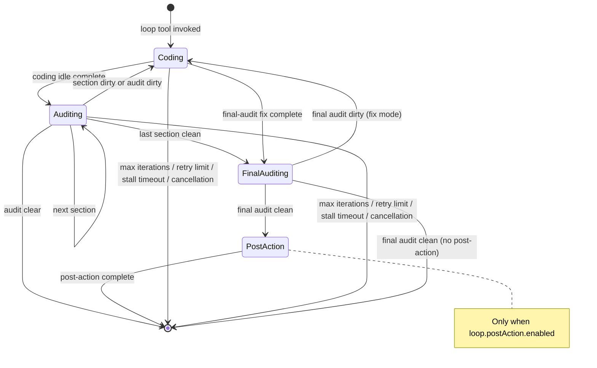
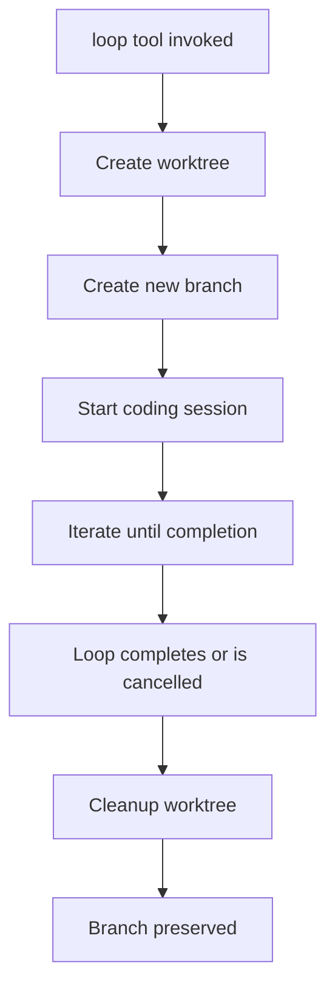

# Loop System Documentation

The loop system provides autonomous iterative development with automatic code auditing.

## Loop Lifecycle Rules

### Plugin Boot Behavior

- **Plugin boot does not mutate loop rows.** Initialization loads storage and runtime services only.
- No loops are recovered, cancelled, restarted, or reconciled during plugin startup.
- Loop recovery and restart are explicit user actions via `loop-status restart=true`.

### Restartability

- **Any non-completed loop is restartable** via explicit restart when the worktree is available.
- Restartable statuses: `running`, `cancelled`, `errored`, `stalled`.
- **Completed loops are history-only** and cannot be restarted.
- **Missing worktree blocks restart** — the worktree directory must exist for restart to proceed.

### Restart Semantics

- Restart preserves loop identity, plan, worktree path, section progress, and review findings.
- Restart resets iteration count and error budget.
- Restart creates a fresh session and resumes from the persisted phase and section index.

### Stale Workspace Sweep

- Stale workspace sweep is **teardown cleanup-only**, not boot-time recovery.
- Sweep removes workspace registrations for non-running restartable loops (`cancelled`, `errored`, `stalled`) while preserving worktrees for manual restart.
- Completed loops are fully removed (registration + worktree).
- Running loops are never touched by sweep.

## Loop Lifecycle



## Loop States

Each loop has a `LoopState` backed by the typed `loops` and `loop_large_fields` SQLite tables:

```typescript
interface LoopState {
  active: boolean                    // Whether loop is currently running
  sessionId: string                  // Current OpenCode session ID
  loopName: string                   // Unique loop identifier
  worktreeDir: string                // Worktree path
  projectDir?: string                // Project directory path
  worktreeBranch?: string            // Branch name if using worktree
  iteration: number                  // Current iteration count
  maxIterations: number              // Maximum iterations (0 = unlimited)
  startedAt: string                  // ISO timestamp
  prompt?: string                    // Original task prompt
  phase: 'coding' | 'auditing' | 'final_auditing' | 'post_action'
  lastAuditResult?: string           // Last audit output
  errorCount: number                 // Consecutive error count
  auditCount: number                 // Number of audits completed
  terminationReason?: string         // Reason for termination
  completedAt?: string               // ISO timestamp
  worktree?: boolean                 // Whether using worktree isolation
  modelFailed?: boolean              // Whether model error occurred
  sandbox?: boolean                  // Whether using Docker sandbox
  sandboxContainer?: string          // Container name if sandboxed
  completionSummary?: string         // Summary of loop completion
  executionModel?: string            // Model used for execution
  auditorModel?: string              // Model used for auditing
  workspaceId?: string               // OpenCode workspace ID
  hostSessionId?: string             // Host session ID for post-completion redirect
  currentSectionIndex: number
  totalSections: number
  finalAuditDone: boolean
}
```

## Session Rotation

Each iteration runs in a **fresh session** to keep context small and prioritize speed:

1. **Coding phase** completes
2. Current session is destroyed
3. New session is created
4. Continuation prompt is injected with:
   - Original task prompt
   - Current iteration number
   - Audit findings (if any)

```typescript
function buildContinuationPrompt(state: LoopState, auditFindings?: string): string {
  let systemLine = `Loop iteration ${state.iteration}`

  if (state.maxIterations > 0) {
    systemLine += ` / ${state.maxIterations}`
  } else {
    systemLine += ` | No max iterations set - loop runs until auditor all-clear or cancelled`
  }

  let prompt = `[${systemLine}]\n\n${state.prompt ?? ''}`

  if (auditFindings) {
    prompt += `\n\n---\nThe code auditor reviewed your changes. You MUST address all bugs and convention violations.`
  }

  return prompt
}
```

## Usage Tracking

Loop usage is captured across rotated code and auditor sessions so `loop-status` can report cumulative cost and token totals after the original session has been replaced.

- `token-usage.ts` extracts assistant message usage, normalizes token fields, and groups totals by model label.
- `loop_session_usage` persists per-session, per-model rows keyed by project, loop name, session ID, and role.
- `loop-status <name>` merges persisted rows with the currently live session output while avoiding double-counting the active session.
- When no loops are active, `loop-status` can still show cumulative usage for completed loops that have persisted usage data.

Tracked token buckets are input, output, reasoning, cache read, and cache write, plus cost and assistant message count.

## Stall Detection

A watchdog monitors loop activity. If no progress is detected within `stallTimeoutMs` (default: 60 seconds), the current phase is re-triggered.

```typescript
const STALL_TIMEOUT_MS = 60_000
const MAX_CONSECUTIVE_STALLS = 5
```

After 5 consecutive stalls, the loop terminates with `terminationReason: 'stall_timeout'`.

## Review Finding Persistence

Audit findings survive session rotation via the **review store**:

```typescript
interface ReviewFinding {
  projectId: string
  file: string
  line: number
  severity: 'bug' | 'warning'
  description: string
  scenario: string | null
  loopName: string | null
  sectionIndex: number | null
  createdAt: number
}
```

At the start of each audit:
1. Existing findings are retrieved via `review-read`
2. Resolved findings are deleted via `review-delete`
3. Unresolved findings are carried forward

Outstanding `severity: 'bug'` findings block loop completion — the loop terminates only when the auditor has run at least once and zero bug-severity findings remain.

## Worktree Isolation

Loops always run in an isolated git worktree. Sandbox is optional: when Docker is available and `sandbox.mode = 'docker'` is configured, a sandbox container is provisioned automatically; otherwise the loop runs in worktree-only mode.

> Note: this applies to the `execute-plan` tool's default `mode: loop`. The same tool also accepts `mode: new-session`, which bypasses the loop entirely and runs the plan in a fresh standalone session with no worktree or sandbox (see [Tools Reference](tools.md#execute-plan)).



Benefits of worktree isolation:
- Isolation from ongoing development
- Safe to experiment without affecting main branch
- Branch preserved for later review/merge
- Per-loop customization via `loop.worktreeOpencodeConfig` — inject MCP servers and other [opencode config](https://opencode.ai/config.json) into each worktree without host config changes or commit pollution (see [Configuration Reference](configuration.md#worktree-opencode-config))

## Sandbox Integration

Sandbox is optional. When Docker is available and configured, a sandbox container is provisioned automatically; otherwise loops run in worktree-only mode.

1. Container created with worktree mounted at `/workspace`
2. `bash`, `glob`, `grep` tools redirect into container
3. `read`/`write`/`edit` operate on host filesystem
4. Container stopped and removed on loop completion

See [sandbox documentation](architecture.md#sandbox-system) for details.

## Milestones (aka sections)

In user-facing language, a plan is decomposed into **milestones** — ordered units of execution. In the code and database, these are called **sections**:

- `section_plans` SQL table — one row per milestone, ordered by `sectionIndex`
- `currentSectionIndex` / `totalSections` columns on the loop row
- `<!-- forge-section -->` markers in the architect plan output
- `section-read` tool reads the current or specified milestone

Decomposition is a one-shot preprocessing step at loop start (`services/deterministic-decomposer.ts`), not a runtime loop phase. Once milestones exist, the loop advances through them via `advance-section` transitions inside the `auditing` phase. When the `final_auditing` phase reports outstanding bug findings, the loop rotates to a coding session in "final-audit fix" mode — the code agent fixes the reported findings without rewinding to a specific section, and on idle the loop transitions straight back to `final_auditing` for re-verification.

## Completion Conditions

A loop completes when the active phase emits a clean audit result (optionally followed by a post-completion action phase):

- Non-sectioned loops complete on `audit-clear`.
- Sectioned loops advance through clean section audits, then complete on `final-audit-clean`.
- Dirty section audits rotate back to coding for the same section so findings can be addressed.
- Dirty final audits rotate to coding in "final-audit fix" mode (no section rewind); when the fix coding pass goes idle, the loop returns straight to `final_auditing`.
- After a clean final audit, if `loop.postAction.enabled` is `true` and specifies a `skill` or `prompt`, the loop enters a `post_action` phase that runs inside the worktree before teardown. Completion occurs when the post-action session goes idle (`post-action-complete` event).

## Post-Completion Action Phase

After a clean final audit, before worktree teardown, the loop may run a **post-completion action** configured via `loop.postAction` in `forge-config.jsonc`. This phase is best-effort — it is not re-audited and relies only on safe, scoped fixes. The post-action runs as the `code` agent in a fresh session inside the worktree.

```jsonc
{
  "loop": {
    "postAction": {
      "enabled": false,       // Enable the post-completion action phase
      "skill": "pr-review",   // Skill to load via the Skill tool (e.g. "pr-review")
      "prompt": "..."         // Extra instruction text; used standalone when no skill is set
    }
  }
}
```

### Configuration

| Field | Type | Default | Description |
|-------|------|---------|-------------|
| `loop.postAction.enabled` | `boolean` | `false` | Enable the post-completion action phase. |
| `loop.postAction.skill` | `string` | — | Name of a skill to load via the Skill tool at action time (e.g. `"pr-review"`). Must be installed host-side. |
| `loop.postAction.prompt` | `string` | — | Optional extra instruction text appended to the action prompt. Used standalone when no skill is set. |

### Behavior

- Runs only after a clean final audit completes.
- Runs **inside the worktree** as the `code` agent, with access to the full worktree state (including uncommitted changes).
- **Best-effort:** The post-action result is not re-audited; it applies only safe, scoped fixes. The question tool is blocked — any finding requiring clarification is auto-deferred.
- On idle (`post-action-complete`), the loop terminates normally.
- If the post-action session fails to create, the loop terminates as completed without retrying.
- **Outcome capture:** On `post-action-complete`, the post-action session's raw final assistant message is stored verbatim in the loop's `completion_summary` (surfaced as **Completion Summary** in the dashboard). The loop status is **always** `completed` regardless of what the post-action reported — the plan itself was already cleared by the final audit; the summary only provides context (alternate-review verdict, CI result, etc.). Completion summary is captured only on the clean `post-action-complete` path; idle-exhausted, error, and abort-without-assistant terminations leave it empty.

## Cancellation

Loops can be cancelled via:
- `loop-cancel` tool
- `/loop-cancel` slash command

Cancellation:
1. Marks loop as inactive
2. Sets `terminationReason` to `'cancelled'`
3. Stops sandbox container if applicable
4. Optionally cleans up worktree (if `cleanupWorktree: true`)

## Error Handling

| Error Type | Behavior |
|------------|----------|
| Model error | Automatic fallback to default model, retry |
| Error retry limit | Loop terminates with `terminationReason: 'error_max_retries'` |
| Audit retry limit | Loop terminates with `terminationReason: 'audit_retry_exhausted'` |
| Final audit retry limit | Loop terminates with `terminationReason: 'final_audit_retry_exhausted'` |
| Stall timeout | Loop terminates with `terminationReason: 'stall_timeout'` after the configured consecutive stall limit |

## Tool Restrictions

Inside active loop sessions:
- `git push` is denied (permission hook)
- `execute-plan` is blocked (tool hooks)
- `question` is blocked (tool hooks)
